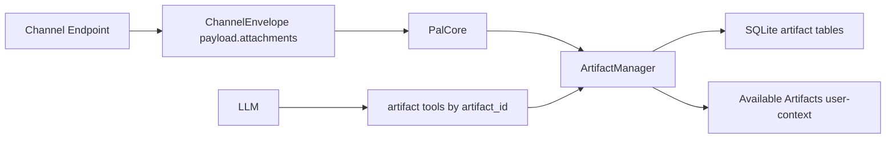

# Artifact Manager V1

## Boundary

`pal.artifact` is a first-party core-foundation subsystem for short-lived conversation attachments.

An artifact is not:

- A local filesystem path exposed to the LLM.
- Durable memory or an L3 document.
- A plugin-owned capability.

An artifact is:

- A scoped conversation resource identified by `artifact_id`.
- Stored and normalized under the runtime root.
- Read only through artifact tools.
- Visible only inside the matching `control_scope_key`.

The module is not detachable. Channel endpoints may receive bytes or local cached files, but `PalCore` owns the handoff into `ArtifactManager`.

## Data Flow

The channel layer only normalizes incoming attachment metadata. `PalCore` passes attachments to the artifact port and replaces raw `attachments` with prompt-safe `artifact_refs`.

`artifact_refs` in the current event payload are authoritative for that turn. If they are present, prompt exposure must show only those artifacts in payload order and must not fall back to old hot artifacts.

## Lifecycle

Default lifecycle:

- Hot TTL: `2h`.
- Refresh amount: `2h`.
- Hard cap: `24h`.
- `info`, `read`, `content_search`, and `select` refresh hot state.
- `artifact_search` does not refresh every returned candidate.
- Expired artifacts are not shown in prompt exposure by default.

Metadata may remain in SQLite, but hot exposure is intentionally short-lived and does not retire to memory/L3.

## Processing

Processing is registry-driven:

- `ArtifactProcessorRegistry` resolves an artifact kind from MIME, extension, or declared kind.
- `ArtifactRepresentationRegistry` defines readable representation kinds and auto-read priority.
- `ArtifactExposurePolicy` lives in typed policy dataclasses and decides prompt exposure without hardcoding file branches in `PromptCompiler`.

Default representations:

- Image: original preserved, normalized image generated after EXIF transpose/strip, resize, and quality ladder.
- Text: UTF-8 text representation and chunks.
- PDF: per-page text and chunks; low-text PDFs render capped page images when PyMuPDF is available.
- Audio: original metadata; transcript only if an ASR port is registered.
- Unknown binary: metadata only.

## Prompt Exposure

`Available Artifacts` is rendered as user-context, not system prompt.

Rules:

- Do not expose raw source secrets such as Telegram bot-token URLs, `telegram_file_path`, or raw `source_url`.
- Prefer explicit current-event `artifact_refs`.
- If no explicit refs exist, show same-turn records.
- If no current records exist and user text is empty, show no historical hot artifacts.
- Historical hot artifacts are shown only for explicit artifact/file/image/audio references, not weak deictic phrases such as "this" or "that".
- URLs are ignored when checking whether user text references a historical artifact, so a URL path segment like `file` or `photos` cannot trigger hot artifact fallback.
- Vision-capable endpoints may receive normalized image/page-image parts under budget. URL source is preferred when available; otherwise Pal serializes a normalized image data URL at the final LLM boundary.
- If image pixels are attached inline, the manifest marks `visual_content: attached_inline` and Pal should answer from vision directly.
- Non-vision endpoints receive an LLM-safe manifest with artifact metadata, representations, and `local_file.preferred_path` when available.
- `local_file.preferred_path` may be used only with a capability that explicitly accepts local paths. It is a bridge for path-capable processors, not a general filesystem permission.

Internal image parts become OpenAI-compatible `image_url` data URLs only at the final LLM serialization boundary.

## Tools

Artifact capabilities:

- `artifact_list`: list hot artifacts visible to the current turn.
- `artifact_info`: inspect metadata and available representations for one artifact.
- `artifact_read`: read text-like representations by `artifact_id`.
- `artifact_search`: search artifact objects by filename, kind, time, caption, or summary.
- `artifact_select`: mark one artifact as chosen and refresh TTL.
- `artifact_grep`: search existing text-like representations inside one known artifact. It does not inspect image pixels, run OCR, or create audio transcripts.
- `artifact_transcribe`: request transcript generation; V1 returns `needs_transcription` without an ASR provider.

Resident LLM tools currently include only:

- `artifact_info`
- `artifact_read`

Other artifact capabilities remain discoverable through execution discovery.

Tool boundary:

- Artifact tools accept `artifact_id`, never local paths.
- Filesystem tools stay path-based and are separate.
- `artifact_search` finds the object.
- `artifact_content_search` searches inside a selected object.

## Extension Points

Future additions should register new behavior through tables/registries:

- Add a processor for a MIME/extension/kind in `ArtifactProcessorRegistry`.
- Add a representation kind in `ArtifactRepresentationRegistry`.
- Adjust prompt exposure by policy, not by adding type branches to `PromptCompiler`.
- Add ASR by providing an `ArtifactTranscriberPort`.

## Invariants

- Artifact scope is `control_scope_key`.
- Raw source secrets never appear in prompt exposure.
- Local paths may appear only as LLM-safe `local_file` metadata and only for tools/capabilities that explicitly accept paths.
- Artifact metadata is not memory and never automatically becomes L3.
- Search does not refresh TTL; selection or actual use does.
- LLM serialization is the only place internal image parts become provider wire format.
