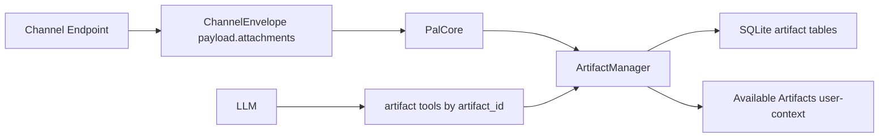

# Artifact Manager V1

## Boundary

`pal.artifact` is a first-party core-foundation subsystem for short-lived conversation attachments.

An artifact is not:

- A local filesystem path exposed to the LLM.
- Durable memory or an L3 document.
- A plugin-owned capability.

An artifact is:

- A scoped conversation resource identified by `artifact_id`.
- Stored and normalized under the runtime root.
- Read only through artifact tools.
- Visible only inside the matching `control_scope_key`.

The module is not detachable. Channel endpoints may receive bytes or local cached files, but `PalCore` owns the handoff into `ArtifactManager`.

## Data Flow

The channel layer only normalizes incoming attachment metadata. `PalCore` passes attachments to the artifact port and replaces raw `attachments` with prompt-safe `artifact_refs`.

## Lifecycle

Default lifecycle:

- Hot TTL: `2h`.
- Refresh amount: `2h`.
- Hard cap: `24h`.
- `info`, `read`, `content_search`, and `select` refresh hot state.
- `artifact_search` does not refresh every returned candidate.
- Expired artifacts are not shown in prompt exposure by default.

Metadata may remain in SQLite, but hot exposure is intentionally short-lived and does not retire to memory/L3.

## Processing

Processing is registry-driven:

- `ArtifactProcessorRegistry` resolves an artifact kind from MIME, extension, or declared kind.
- `ArtifactRepresentationRegistry` defines readable representation kinds and auto-read priority.
- `ArtifactExposurePolicy` lives in typed policy dataclasses and decides prompt exposure without hardcoding file branches in `PromptCompiler`.

Default representations:

- Image: original preserved, normalized image generated after EXIF transpose/strip, resize, and quality ladder.
- Text: UTF-8 text representation and chunks.
- PDF: per-page text and chunks; low-text PDFs render capped page images when PyMuPDF is available.
- Audio: original metadata; transcript only if an ASR port is registered.
- Unknown binary: metadata only.

## Prompt Exposure

`Available Artifacts` is rendered as user-context, not system prompt.

Rules:

- Do not expose local paths.
- Do not expose all internal metadata.
- Prefer current-turn artifacts.
- Include hot same-scope artifacts only when user text appears artifact-relevant.
- Vision-capable endpoints may receive normalized image/page-image parts under budget.
- Non-vision endpoints receive manifest/tool guidance only.

Internal image parts become LiteLLM `image_url` data URLs only at the final LLM serialization boundary.

## Tools

LLM-visible tools:

- `op_artifact_list`: list hot artifacts visible to the current turn.
- `op_artifact_info`: inspect metadata and available representations for one artifact.
- `op_artifact_read`: read text-like representations by `artifact_id`.
- `op_artifact_search`: search artifact objects by filename, kind, time, caption, or summary.
- `op_artifact_select`: mark one artifact as chosen and refresh TTL.
- `op_artifact_content_search`: search inside one known artifact.
- `op_artifact_transcribe`: request transcript generation; V1 returns `needs_transcription` without an ASR provider.

Tool boundary:

- Artifact tools accept `artifact_id`, never local paths.
- Filesystem tools stay path-based and are separate.
- `artifact_search` finds the object.
- `artifact_content_search` searches inside a selected object.

## Extension Points

Future additions should register new behavior through tables/registries:

- Add a processor for a MIME/extension/kind in `ArtifactProcessorRegistry`.
- Add a representation kind in `ArtifactRepresentationRegistry`.
- Adjust prompt exposure by policy, not by adding type branches to `PromptCompiler`.
- Add ASR by providing an `ArtifactTranscriberPort`.

## Invariants

- Artifact scope is `control_scope_key`.
- Local paths never appear in prompt exposure or tool-facing metadata.
- Artifact metadata is not memory and never automatically becomes L3.
- Search does not refresh TTL; selection or actual use does.
- LLM serialization is the only place internal image parts become provider wire format.
