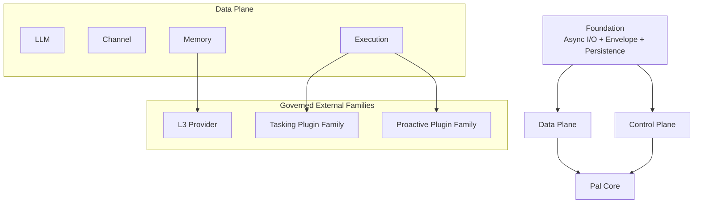
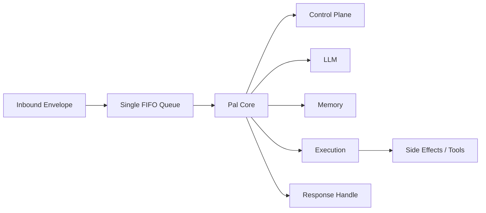

# Pal 架构宪法 V1

> 2026-04-07
>
> 这份文档是 `Pal` 的新架构基线。
> 它定义后续重构和实现的唯一上位约束，并直接吸收旧 `design/` 中已经成熟的稳定语义。

## 目标

`Pal` 不是“聊天壳 + 工具列表”。

`Pal` 是一个：

- 事件驱动的主体
- 以 `Pal Core` 为极薄治理中心的 runtime
- 拥有统一能力运行时的 agent system
- 拥有分层记忆的长期主体
- 拥有独立控制平面的可治理系统
- 拥有受约束的自观察、自诊断、自维护能力

## 总体分层

### Foundation

Foundation 是系统最低层：

- `Async I/O`
- `Envelope`
- `Persistence`

它提供安全、可靠、异步、可持久化的底座，但不拥有领域语义。

### Data Plane

`Pal` 的数据面固定为四个子系统：

- `LLM`
- `Channel`
- `Memory`
- `Execution`
- `Artifact`

它们负责感知、表达、记忆、行动。

`Artifact` owns short-lived conversation attachments. It is separate from both filesystem tools and durable memory. Channels provide normalized attachment inputs; `PalCore` registers them; the LLM sees only prompt-safe `artifact_id` references and artifact tools.

### Control Plane

`Control` 是独立控制平面，不属于数据面。

它负责：

- 显式命令
- 审批
- 状态切换
- 暂停与恢复
- 用户可理解的治理动作

### Pal Core

`Pal Core` 站在数据面和控制平面之上。

它只负责：

- 事件主循环
- 最小控制态
- 决策与调度
- 跨子系统协调

`Pal Core` 不是状态仓库，也不是业务对象仓库。

## 系统不变量

1. `Pal Core` 极薄。
2. `Execution` 是唯一副作用出口。
3. `Tool` 是唯一执行原语。
4. `Capability` 是给 LLM 看的语义能力面。
5. `Plugin` 提供 `Tool` 并注册 `Capability`。
6. `Skill` 只提供方法指导，不能覆盖 `Pal` 自身 policy，也不能注入新人格。
7. `Control` 是独立治理平面，不直接承担开放式推理。
8. `L1/L2` 属于 runtime memory，纯驻留 RAM，重启即丢失。
9. `L3` 是外挂、可插拔、searchable durable memory engine。
10. `Task`、`Proactive`、`L3` 都是外挂，但受治理。
11. 用户与 `Pal` 在所有 channel 上的交互必须进入同一个 FIFO 治理队列。
12. `page_fault` 机制被 `L1/L2/L3` 分级记忆完全取代。
13. 所有子系统都必须提供 introspection surface。
14. `Pal` 可以自观察、自诊断、自维护，但不能越过核心 identity / policy / constitutional constraints。
15. 用户前台 channel 必须由 `Pal` 自己持有，`supervisor` 不代理正常用户消息。
16. worker 永远不直接接触用户，只能与 `Pal` 通信。
17. provider native tool calling 只是外部协议壳，不能绕过本地 `Execution`。
18. `L1` 是近无损压缩后的 transcript，不是 summary bucket。
19. `top_of_mind` 只允许作为热投影层存在，不是 durable truth。
20. `blocked / interrupted / error` 等终态不能盲续旧执行栈，只能基于当前现场重新观察和重启。

## 主体模型

`Pal` 是单主体、单用户、单治理队列的系统。

这意味着：

- 不同 channel 只是同一主体输入流的不同接入口
- `Pal` 不在多个 channel 上维护多个独立人格
- 用户可以清空上下文
- 用户不应切换到多个并行 memory conversation

## 核心运行模型

运行抽象固定为：

`EventEnvelope + minimal control state -> Decision -> Capability Invocation -> Tool Effect / Follow-up Event`

## Memory 总原则

`Memory` 是独立子系统。

- `L1` 是压缩后的近端对话层
- `L2` 是 hot working set
- `L3` 是长期 durable search engine

其中：

- `L1/L2` 内建于 runtime
- `L3` 是外挂 provider
- `Pal Core` 不直接读写 memory store

## Execution 总原则

`Execution` 是整个系统中最关键的边界层。

它负责：

- capability registry
- capability routing table
- tool registry
- plugin runtime
- introspection index
- validator pipeline
- side-effect dispatch

任何真实副作用都只能通过 `Tool` 完成。

## Provider Pattern 总原则

`Pal` 内部存在两类 provider 模式，不应混为一谈：

### 1. Fallback-capable providers

适用于：

- `llm`
- `web_search`
- `web_fetch`

它们的共同点是：

- 单次请求可切换 provider
- 切换成本低
- 失败后可以继续尝试下一候选

因此这类能力应采用：

- ordered provider candidates
- priority
- enabled / disabled state
- fallback

### 2. Migration-only providers

适用于：

- `embedding`
- 其他需要重建或迁移的索引型 backend

它们的共同点是：

- provider 一旦变化，会影响长期索引一致性
- 不适合在单次请求中随意切换
- 需要 migration / reindex 才能切 active version

因此这类能力不应采用 runtime fallback，而应采用：

- versioned provider
- rebuild / reindex
- promote / rollback

## Control 总原则

`Control` 是 built-in 治理平面。

它处理：

- slash command
- worker approval request
- system control signal
- mode switch
- explicit pause / resume / cancel / approve

`approve` 是 built-in control capability。

## Self-Maintenance 总原则

`Pal` 支持：

- self-observation
- self-diagnosis
- self-improvement planning
- controlled self-repair

但默认不允许：

- 在无关对话里顺手修改自己
- 越过审批边界进行结构性变更
- 覆盖核心 policy、identity 或 persona contract

## Non-Goals

以下内容不属于本架构版本的目标：

- 多主体并行人格系统
- 多用户共享 `Pal` 主体
- 对 `L1/L2` 做 durable shadow persistence
- 继续保留 `page_fault` 型静默回忆机制
- 让 `Skill` 成为执行层或人格注入层
- 让 `Pal Core` 直接拥有 task、proactive、worker、memory durable state

## 后续文档

本宪法的下位文档是：

- `pal_runtime_stack.md`
- `pal_bootstrap_and_process.md`
- `pal_execution_contract.md`
- `pal_introspection_contract.md`
- `pal_tasking_contract.md`
- `pal_proactive_contract.md`
- `pal_control_plane.md`
- `pal_memory_contract.md`
- `pal_failure_reporting_contract.md`
- `pal_migration_map.md`
