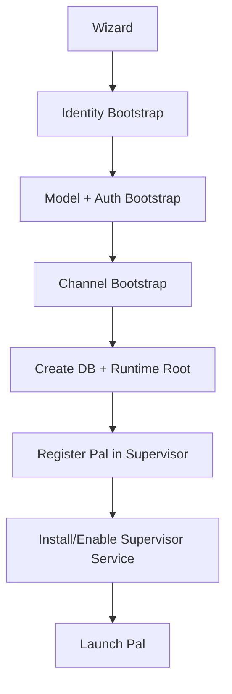

# Pal Bootstrap And Process Contract

> 目标：定义 setup wizard、supervisor、Pal、worker 的启动关系，以及首次安装时的最小配置流程。

## 目标

这一版不重发明旧的 process 语义。

它主要做两件事：

- 保留旧版本已经明确的 `supervisor -> pal -> worker` 生命周期边界
- 把 setup wizard、初始注册、运行环境准备、模型授权配置收成统一 bootstrap 流程

## 核心结论

新架构推荐采用两层启动面：

- 用户看到的是 `wizard`
- 系统依赖的是 `supervisor service`

也就是说：

- `wizard` 负责第一次配置体验
- `supervisor` 负责长期运行、拉起和监控 `Pal`

这两者不是二选一，而是配套关系。

## 进程关系

系统中的核心进程关系保持为：

- `supervisor -> pal -> worker`

并允许：

- `pal -> worker`
- `worker -> worker`

但有一条硬边界：

- 所有 worker 与用户的通信都必须经过 `Pal`

也就是说：

- worker tree 可以存在
- user-facing channel 永远只属于 `Pal`

## Supervisor 的职责

`supervisor` 是 lifecycle manager。

它负责：

- 注册新的 `Pal` 实例
- 准备数据库和 runtime root
- 维护 `Pal` 的启动配置
- 拉起 `Pal`
- 监控 `Pal`
- `Pal` 崩溃时自动重拉
- 重建 control / IPC 关联

它不负责：

- 正常用户消息代理
- channel ownership
- memory 管理
- tool 执行

## `Pal` 的职责

`Pal` 是唯一用户前台主体。

它负责：

- 持有 channel
- 接收用户输入
- 运行主循环
- 调用 memory / llm / execution / control
- 拉起 worker
- 观察 worker
- 与用户通信

## Worker 的职责

worker 是执行体，不是主体。

它负责：

- 接收 task context
- 执行任务
- 上报 checkpoint / progress / done / failed
- 必要时拉起子 worker

但它始终：

- 不直接接触用户
- 不拥有用户前台 channel

## Wizard 的职责

`wizard` 是首次安装和初始化入口。

它的目标是让用户在最少步骤下初始化一个可运行的 `Pal`。

### Wizard 必须收集的配置

#### 1. Pal Identity Bootstrap

wizard 必须记录：

- `display_name`
- `vibe`
- `tone`
- `persona notes`
- `core policy / behavioral constraints`
- 默认语言

这些配置决定：

- `Pal` 的主体气质
- 长期交互风格
- 默认政策边界

它们属于 setup 初始化，不允许被 skill 覆盖。

#### 2. Model Bootstrap

wizard 必须让用户：

- 选择默认模型或 endpoint array
- 设定优先级
- 输入或确认 base URL
- 填写能力信息
- 选择默认 fallback 顺序

这些结果写入本地模型注册表，例如：

- `llm_endpoints`

#### 3. Auth Bootstrap

wizard 必须让用户输入或绑定授权信息：

- API key
- OAuth
- provider-specific auth handle

授权信息不应明文写入数据库。

它们应写入：

- keychain
- oauth credential ref
- provider auth reference

然后在数据库中只保存 ref。

#### 4. Channel Bootstrap

wizard 必须初始化用户前台 channel。

例如：

- socket
- stdio
- Telegram

并写入相应 endpoint / send policy / auth 配置。

## Wizard 与 Service Install

推荐产品形态是：

- wizard 负责首次配置
- wizard 末尾负责安装并注册 supervisor service

也就是说，用户不需要手动理解整个进程树。

他们看到的是：

1. 配置 `Pal`
2. 选择模型并授权
3. 选择 channel
4. 完成安装

系统内部实际完成的是：

1. 注册 supervisor
2. 建立数据库
3. 建立 runtime root
4. 绑定用户与本地实例
5. 拉起 `Pal`

## 推荐 Bootstrap 流程



## 当前实现对齐

当前仓库里已有这条线的雏形：

- setup wizard 入口在 [setup_wizard.py](/Users/nathan/Desktop/coding/Pal/src/pal/cli/setup_wizard.py)
- supervisor 入口在 [supervisor.py](/Users/nathan/Desktop/coding/Pal/src/pal/runtime/supervisor.py)
- `main.py` 已经提供 `setup` 与 `supervisor` 角色入口，见 [main.py](/Users/nathan/Desktop/coding/Pal/src/pal/main.py)

当前 wizard 已经具备这些能力：

- identity
- LLM endpoints
- API key 写入 keychain
- channel 选择
- policy 配置
- DB 初始化

新版本在此基础上继续收口为：

- 更明确的 identity bootstrap
- 更明确的 model registry / auth bootstrap
- 更明确的 supervisor registration

## 恢复原则

### `Pal` 崩溃

- `supervisor` 负责立即重拉
- 重新建立 control / runtime 关联
- 不盲续旧执行栈

### worker 崩溃

- `Pal` 负责观察并处理
- 基于 checkpoint / ledger 决定恢复、替换或终止

## Invariants

- `wizard` 负责初始化体验，`supervisor` 负责长期生命周期治理。
- `supervisor` 负责注册、拉起、监控 `Pal`。
- `Pal` 是唯一用户前台主体。
- `worker` 可以拉起子 worker，但所有用户通信都必须经过 `Pal`。
- wizard 必须记录 `Pal` 的 vibe / tone / persona / policy。
- wizard 必须完成模型选择和授权配置。
- 授权信息存 ref，不存明文密钥。

## 当前实现对齐（2026-04 更新）

### compose_runtime() 扩展

当前 `compose_runtime()` 已完成以下扩展：

- 注册 `failure` 模块（`register_failure_with_core`）
- 通过 `PluginHost.bootstrap()` 自动加载第一方插件（`plugins_builtin/`），包括 `web_search`、`web_fetch`、`sqlite_vec_l3`
- `supervisor.seed_defaults()` 预置 web_search / web_fetch 的默认 provider 配置

### StubRuntimeHandle.stop_async()

`StubRuntimeHandle` 新增 `stop_async()` 方法，用于优雅关闭：

```python
async def stop_async(self) -> None:
    await self.channel_runtime.stop_async()
    for handle in self.core.context.module_registry.modules.values():
        # 调用模块的 shutdown_async 或 shutdown_sync
        ...
    self.database.close()
```

这保证：

- 先关闭所有 channel endpoint（停止接收新消息）
- 再逐个调用注册模块的 shutdown hook
- 最后关闭数据库

### ModuleHandle shutdown hooks

`ModuleHandle` 新增两个可选字段：

- `shutdown_sync: Callable[[], None] | None` — 同步关闭
- `shutdown_async: Callable[[], Awaitable[None]] | None` — 异步关闭

模块可以在 `register_with_core()` 时注册 shutdown hook，用于清理资源（如关闭 browser service 进程）。

## Non-Goals

- 不在本文件定义具体 UI 界面
- 不在本文件定义 systemd / launchd 的细节
- 不在本文件定义完整 installer 脚本
