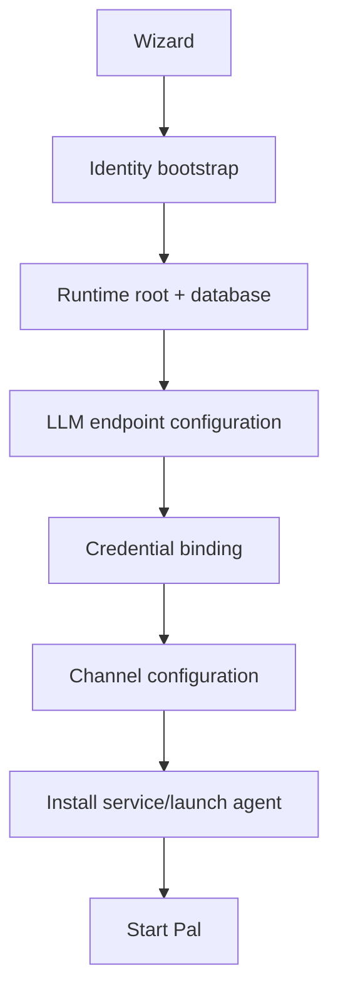

# Pal Bootstrap And Process Contract

This document defines the process relationship between setup wizard,
supervisor/service management, Pal, and workers. It also documents the minimum
first-install bootstrap flow.

## Goals

The bootstrap contract keeps the existing lifecycle boundary:

```text
supervisor/service -> pal -> worker
```

and folds first-install setup into one guided path:

- local identity
- runtime root
- database initialization
- model endpoint configuration
- provider credentials
- channel configuration
- service install/start

## Core Conclusion

Pal has two startup surfaces:

- the user-facing setup wizard
- the long-running supervisor/service layer

They are complementary:

- the wizard owns first-run configuration
- the service layer owns long-running startup, restart, and monitoring

## Process Relationship

The core process relationship is:

- `supervisor/service -> pal -> worker`

Allowed expansions:

- `pal -> worker`
- `worker -> worker`

Hard boundary:

- user-facing channel ownership belongs to `Pal`
- worker communication with the user must route through Pal
- workers do not own direct user channels

## Supervisor / Service Responsibilities

The supervisor or host service manager is responsible for:

- registering a Pal instance
- preparing the runtime root
- ensuring the database exists
- preserving the Pal launch command
- starting Pal
- restarting Pal after crashes
- reestablishing local process/control associations

It does not own:

- normal user message routing
- channel semantics
- memory policy
- LLM routing policy
- tool execution

On Linux this may be represented by a user systemd service. On macOS this may
be represented by a launchd plist. The contract is service-manager agnostic.

## Pal Responsibilities

`Pal` is the single foreground agent process.

It owns:

- channel endpoints
- normalized user input
- the main turn loop
- prompt assembly
- memory / LLM / execution / control coordination
- worker/bunshin spawning and observation
- final user-visible replies

## Worker Responsibilities

Workers and bunshins own delegated work. They may:

- perform task-specific execution
- write workspace artifacts
- report progress through manager IPC
- request approval through Pal
- emit terminal events through Pal

Workers must not:

- bypass Pal channels
- mutate Pal governance directly
- recursively expose Pal's full capability registry unless explicitly scoped

## Wizard Responsibilities

The setup wizard collects enough information to create a runnable local Pal
instance.

Minimum configuration:

1. Identity
   - Pal display name
   - primary user label
   - locale/timezone defaults when available
2. Runtime root
   - target directory
   - database path
   - log/output paths
3. Model endpoints
   - provider
   - model id
   - API mode / adapter hints
   - base URL
   - priority
   - capabilities such as tools, streaming, reasoning, and vision
4. Credentials
   - auth kind
   - credential reference
   - keychain or provider-local auth material
5. Channels
   - channel kind
   - endpoint id
   - binding/auth material
   - enabled state
6. Service install
   - service/plist path
   - launch command
   - working directory
   - log path

Credentials should be stored through the configured credential mechanism, not as
plain text in repository files.

## Recommended Bootstrap Flow



## Current Implementation Alignment

Current code entry points:

- setup wizard CLI: [wizard/cli.py](../src/pal/wizard/cli.py)
- setup wizard runtime: [wizard/runtime.py](../src/pal/wizard/runtime.py)
- CLI entrypoint: [main.py](../src/pal/main.py)

The current wizard line covers:

- identity bootstrap
- LLM endpoint rows
- API key credential binding
- channel selection
- policy/config generation
- database initialization

## Runtime Composition

`compose_runtime()` is responsible for constructing a runnable Pal runtime from
repositories, services, providers, and plugins.

Composition should:

- instantiate first-party module services
- register builtin providers
- load configured runtime providers
- publish selected capability subtrees
- attach enabled endpoints
- expose control/introspection surfaces

Shutdown should be explicit. Runtime handles and module handles should provide
stop hooks where they own background processes, IPC clients, watchers, or
sidecars.

## Recovery Principles

### Pal Crash

The service layer restarts Pal. Pal reloads runtime root state, reconnects to
configured channels, republishes capabilities, and resumes from durable stores.

On SIGINT/SIGTERM, resident Pal stops admitting turns and writes an encrypted,
atomic runtime checkpoint before attempting optional shutdown compaction. The
compaction gets one attempt and a configurable deadline (75 seconds by default);
failure or timeout leaves the already-written full L1 checkpoint intact. A
successful compact replaces it. The next process restores and consumes the
checkpoint before starting channel endpoints. This lifecycle path performs no
periodic saves; an unannounced SIGKILL, power loss, or OOM kill before the exit
checkpoint begins cannot be intercepted.

### Worker Crash

Pal or the relevant manager sidecar records the failure, marks the run/work
order state, and decides whether retry, user approval, or final failure reporting
is appropriate.

## Invariants

- Pal is the only user-facing foreground agent.
- Workers do not own channels.
- First-run setup should produce a runnable runtime root.
- Provider credentials are write-only configuration from Pal's perspective.
- Service install is platform-specific; the lifecycle contract is not.
- Crash recovery reads durable runtime state instead of relying on in-memory
  process state.

## Non-Goals

- This document does not define channel-specific UX.
- This document does not define every bunshin profile.
- This document does not require one universal service manager.
- This document does not define UI screens beyond the bootstrap data contract.
