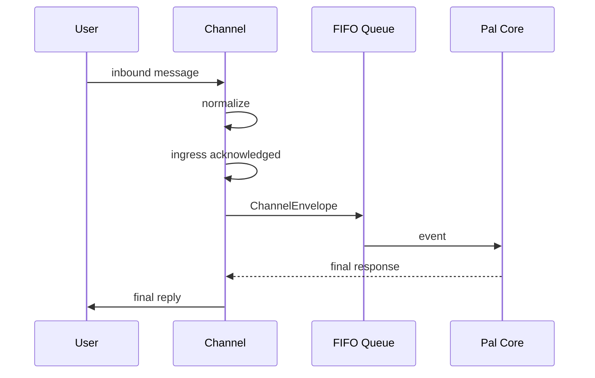

# Pal Channel Contract

> 目标：定义 `channel` 子系统的职责、交互契约，以及 IM 场景下的 ingress acknowledgement UX。

## 目标

`channel` 子系统负责：

- 接收外部输入
- 归一化输入
- 为 `Pal Core` 创建标准 envelope
- 根据 channel 规则发送最终回复
- 维护用户可理解的接收中与处理中反馈
- 提供 channel-owned interaction realization

它不负责：

- agent reasoning
- memory 逻辑
- capability 执行
- control 决策
- 决定某个平台的交互 UI 应该长什么样

## Owns

- inbound receive
- inbox / poll loop
- normalize
- endpoint lookup
- response routing
- segmented send
- typing / status feedback
- ingress acknowledgement UX
- interaction rendering and callback normalization
- optional ingress / egress delivery log
- provider lifecycle for channel endpoints

## Does Not Own

- prompt 组装
- llm provider 调用
- memory lifecycle
- capability routing
- tool execution
- conversation-owned durable route state
- platform-specific behavior in `Pal Core`

## Attachment Ingress

Channel endpoints may normalize incoming platform attachments into `payload.attachments`.

Rules:

- The endpoint may download/cache platform bytes when required by the platform.
- The endpoint must not decide prompt exposure or LLM serialization.
- The endpoint must not expose platform callback/file details beyond normalized metadata.
- `PalCore` hands normalized attachments to `pal.artifact`.
- After registration, inner layers use `artifact_id` and artifact tools, not channel-specific file handles.

For the full managed artifact lifecycle, see [artifact_manager.md](artifact_manager.md).

## 简化结论

`channel` 在新架构中的统一形状应尽量简单。

它只需要做到：

1. 从外部世界收消息
2. normalize 成统一 `ChannelEnvelope`
3. 投递到 mailbox
4. 在 envelope 自带的 respond/status 接口上完成回复

换句话说：

- `Pal Core` 不应理解 Telegram、stdio 等平台细节
- `channel` 也不应反过来承担业务推理
- 如需写 ingress / egress log，应由具体 channel 实例自己完成
- 不再需要把 channel route durability 做成 memory 或 core 的一等真相源
- 交互可以是统一概念，但具体 realization 必须留给 channel provider

## 核心对象

### `ChannelEndpointProviderManager`

`ChannelEndpointProviderManager` 是 channel 子系统对 core、execution 和 LLM 暴露的统一入口。

它负责：

- 注册 builtin channel provider
- 扫描 runtime root 中的 channel provider
- 将 endpoint 解析到负责它的 provider
- 暴露 provider / endpoint introspection capability
- 将 attach、detach、restart、reload 这类管理动作转发给 provider

它不负责：

- 直接实现 Telegram、socket、stdio 或任何具体平台行为
- 决定某个 channel 的交互 UI 形态
- 持有 channel secret 的业务含义
- 绕过 provider 直接创建 platform SDK client

推荐心智模型是：

- manager 是统一注册表与 LLM 可见管理入口
- provider 是 endpoint 的实际 owner
- endpoint 是数据库中可持久化、可 attach 的 channel 实例

### `ChannelProvider`

每个 channel provider 必须拥有自己的 endpoint lifecycle 和 introspection 语义。

Provider 至少应表达：

- `provider_id`
- `endpoint_types`
- `list_endpoints(context)`
- `attach_endpoint(endpoint_id, context)`
- `detach_endpoint(endpoint_id, context)`
- `restart_endpoint(endpoint_id, context)`
- `inspect_endpoint(endpoint_id, context)`
- `inspect_auth_state(endpoint_id, context)`
- `inspect_backlog(endpoint_id, context)`
- `inspect_health(endpoint_id, context)`

这些方法返回统一 `IntrospectionResult`，但结果内容由 provider 自己决定。

这条规则很重要：

- manager 不能假设 endpoint 是 Telegram
- manager 不能假设 auth/backlog/health 的字段
- manager 不能假设 attach/detach 的具体副作用
- provider 才知道如何解释自己的 endpoint 状态

### Runtime Provider Layout

Runtime root 中的动态 channel provider 使用固定目录形状：

```text
<runtime_root>/channel/providers/<provider_id>/
  provider.toml
  runtime.py
```

`provider.toml` 至少包含：

```toml
provider_id = "example"
entrypoint = "runtime.py"
version = "0.1.0"
enabled = true
reload_modules = []
```

`runtime.py` 必须导出：

```python
def build_channel_provider(context):
    ...
```

`context` 包含 runtime root、provider 目录、manifest，以及 manager/runtime/repository/secret resolver 等 channel provider 需要的边界对象。

`channel_provider_rescan` 的语义是：

- 重新扫描 `runtime_root/channel/providers`
- 加载此前没有注册的 provider
- 可选地 attach enabled endpoints
- 不替 provider 决定 endpoint 的具体 attach 机制

### `EndpointConfig`

描述一个可接收、可回复的 channel endpoint。

至少包含：

- `endpoint_id`
- `channel_kind`
- `binding_metadata`
- `enabled`
- `send_policy`
- `reply_policy`

其中 `send_policy` 至少应表达：

- `max_message_chars`
- `preferred_parse_mode`
- `segment_by_default`
- `preserve_code_blocks`
- `supports_typing`
- `supports_receipt_marker`
- `supports_message_edit`

也就是说，channel 数据库中必须有“单条输出上限”这一类发送约束配置，而不应把它硬编码在 `Pal Core` 中。

`channel_kind` 是 endpoint 持久化与反序列化用的类型 discriminator。

它不是 channel 抽象的中心，也不应该被 core 用来推断平台行为。运行期行为应由 provider 的 `endpoint_types` 和 endpoint 归属关系决定。

### `ResponseHandle`

描述如何把回复送回原来源。

至少包含：

- `respond(text: str)`
- `set_status(kind: str)`
- `capabilities`

其中：

- `respond(text: str)` 接收最终回复文本本身
- `set_status(kind: str)` 用于 `typing`、`received` 之类的轻量状态反馈
- chunk、parse mode、MarkdownV2、平台长度限制都在 handle 内部完成

`ResponseHandle` 是对旧版 `DeliveryRoute.reply_handle + adapter.send(...)` 的简化收口。

### `ChannelEnvelope`

`channel` 创建并投递给主循环的统一入口对象。

它至少表达：

- `channel_kind`
- `endpoint_id`
- `message_id`
- normalized payload
- `ResponseHandle`
- correlation id
- created_at

推荐心智模型是：

- `ChannelEnvelope` 是主循环唯一需要理解的 channel 输入
- 主循环不再需要理解 platform route 细节
- 回复路径完全通过 `ResponseHandle` 回到 channel 实例

## Unified Channel Interface

推荐每个 channel endpoint 对外都收成同一组语义：

- `start()`
- `stop()`
- `iter_inbound() -> AsyncIterator[ChannelEnvelope]`
- `normalize(raw) -> ChannelEnvelope`
- `respond(handle, text: str)`
- `set_status(handle, kind: str)`

如果某个实现更喜欢把最后两步收进 handle 自身，也可以等价理解成：

- `envelope.response_handle.respond(text)`
- `envelope.response_handle.set_status(kind)`

关键不是面向对象风格，而是统一语义：

- 输入统一成 envelope
- 输出统一成 respond/status
- 具体平台差异留在 channel provider / endpoint 内部

## Interaction Contract

Interaction 是统一语义，不是统一 UI。

Core、control、minion、tasking 等模块可以产生 typed interaction intent，例如：

- command list
- confirmation
- approval decision
- lesson decision
- choice action
- status update

Channel provider 负责将这些 intent 变成自己的平台 realization。

例如：

- Telegram 可以使用 inline keyboard、callback query、message edit、reaction、typing
- socket channel 可以使用结构化 JSON event
- CLI / stdio channel 可以使用文本菜单或命令回传
- Web channel 可以使用 native button、toast、panel 或 form

共同约束是：

- provider 必须把平台 callback 归一化成 typed interaction result
- core 不接收 Telegram callback payload 之类的平台 raw object
- 已注册 slash command、button callback、menu choice 都应在进入 core 前被 channel/control 解析成明确 action
- 未匹配任何已注册 command 或 alias 的 `/...` 文本应回落成普通 `user.message`，不能被 control path 当作 unknown-command 截断
- provider 可以决定如何展示，但不能改变 action 的业务语义
- interaction state、token mapping、message edit、delivery retry 属于 provider implementation concern

换句话说：

- `interaction` 是 Pal 内部的 typed contract
- `inline keyboard` 只是 Telegram provider 的一种 realization
- manager 不应该硬编码任何 interaction UI
- channel provider 必须提供自己的 interaction rendering、status update 和 result normalization

## 主路径



## Ingress Acknowledgement

`channel` 在接收到用户消息并成功入队后，应尽快给出一个轻量、明确、低打扰的“已收到”反馈。

这个反馈的目标不是回复业务内容，而是告诉用户：

- 消息已被 `Pal` 收到
- 已经进入处理队列
- 不是丢了，也不是机器人没有看见

## Ingress Feedback 三阶段

IM channel 的默认反馈流程固定为：

1. `ingress accepted`
2. `processing visible`
3. `final response delivered`

也就是说：

- 一入队先做“已接收”反馈
- 然后切到 typing / processing 状态
- 最后再发送正式回复

## Telegram Realization

对于 Telegram 这类 IM channel，默认 realization 定为：

1. 消息成功进入 `Pal` 队列后，立即给用户消息打一个 `eyes` 标记
2. 随后切换到 typing indicator
3. 等 `Pal Core` 产出最终回复后，再按 Telegram policy 分流并发送成品内容

这样做的原因是：

- bot 自己发出的消息天然有双勾，无法表达“是否已收到用户消息”
- 眼睛标记更像 receipt marker，而不是额外噪音消息
- typing 适合表达“Pal 正在处理”
- 最终回复仍保持干净，不混入临时确认文本
- 长回复和复杂格式应由 Telegram 侧分流策略负责安全拆分

## Why Not Raw Delta Streaming

IM channel 默认不应直接承接 provider raw stream。

原因包括：

- 分段限制
- edit/send 频率限制
- Markdown / code block 截断
- 半成品文本抖动

因此：

- `llm` 内部可以 streaming
- `channel` 默认只做 status/typing 呈现
- 最终成品再由 `channel` 按 send policy 输出

## Channel-Specific UX Rule

`channel` 子系统允许为不同 IM 平台定义各自的 acknowledgement UX。

但必须满足共同约束：

- 不额外污染对话流
- 不假装已经完成理解或执行
- 不与正式业务回复混淆
- 不替代 typing/status

Telegram 的 `eyes` 标记是其中一种 channel-specific 实现，而不是全局强制 UI。

## Segment Send Rule

最终回复一旦形成，应由 `channel` 根据 endpoint policy 决定：

- 一次性发送
- 分段发送
- 是否需要拆 code block
- 是否需要按平台限制截断重组

这一步发生在最终回复阶段，而不是 provider streaming 阶段。

更一般地说：

- 如果某个 channel 的输出侧存在单条消息上限
- 或者存在严格的格式完整性要求

那么该 channel 就必须拥有自己的 response segmentation 逻辑。

也就是说，是否分流的判定不应写死在 `Pal Core`，而应由 channel policy 决定。

推荐的配置来源就是 endpoint 对应的 `send_policy.max_message_chars`。

### Telegram Segmentation Rule

Telegram 默认应使用 channel-owned response segmentation。

也就是说：

- `Pal Core` 产出的是统一 final response
- `channel` 负责把它按 Telegram 限制拆成安全消息段
- 分流后的每段仍然属于同一次正式回复，而不是新的业务事件

Telegram 分流策略至少应考虑：

- 单条消息长度限制
- Markdown / code block 完整性
- 列表与引用块不要在中间被破坏
- 尽量在语义边界处分段，而不是机械按字符截断
- 多段消息的发送顺序必须稳定

推荐行为：

- 优先按段落、标题、代码块边界拆分
- 超长代码块单独成段
- 如有必要，在后续分段中保留最小上下文提示

这样可以避免：

- Telegram 截断成半截消息
- 代码块闭合错误
- 多段回复顺序混乱
- 用户误以为是多次独立回复

## Current Telegram Implementation Alignment

当前仓库里的 Telegram 适配器实现位于：

- [runtime.py](../src/pal/plugins_builtin/telegram_channel/runtime.py)
- [telegram_endpoint.py](../src/pal/channel/endpoints/telegram_endpoint.py)

当前依赖位于：

- [pyproject.toml](../pyproject.toml)

当前实现已明确依赖：

- `python-telegram-bot>=20.7,<22`
- `telegramify-markdown>=0.4,<1`

当前 Markdown 渲染路径是：

1. 先把 LLM 输出交给 `telegramify_markdown.markdownify`
2. 再以 `MarkdownV2` 作为 `parse_mode` 发送
3. 如 MarkdownV2 失败，则回退为 plain text

这说明：

- Telegram 输出格式本身就是 channel-owned concern
- 分段逻辑也应继续由 Telegram endpoint/provider 自己负责
- inline keyboard、callback token、message edit 也属于 Telegram provider realization

## Logging Boundary

如果需要记录 channel ingress / egress log，应由 channel 实例自己负责。

例如：

- 原始 inbound message receipt
- response send attempts
- segmentation outcome
- status/receipt marker failures

这些 log 的归属是 channel implementation concern，而不是 `Pal Core` concern。

这条边界的意义是：

- 不让 core 理解 Telegram/stdio 的发送细节
- 不让 memory / tasking 背负 channel delivery 现场
- 保留每个 channel 对自己平台特性的自治处理能力

## Telegram SDK Helper 结论

当前设计不应假设 `python-telegram-bot` 会替我们自动完成长消息分块。

原因是：

- 当前仓库实现里没有使用任何现成 chunk helper
- 官方文档明确暴露了消息长度限制常量，但没有形成一条可直接依赖的“自动安全分块发送”主路径

因此，架构结论保持为：

- `python-telegram-bot` 负责 Telegram API 交互
- MarkdownV2 转换由 `telegramify-markdown` 负责
- 安全分流、代码块保护、语义边界切分，仍由 `channel` 自己实现

## Invariants

- `channel` 只做 I/O、normalize、route、interaction realization 和 UX feedback。
- `ChannelEndpointProviderManager` 是统一入口，不是平台行为 owner。
- provider 拥有自己的 endpoint lifecycle、attach/detach/restart 和 introspection。
- `ChannelEnvelope + ResponseHandle` 是 channel 与主循环之间的统一接口。
- interaction 是 typed contract；具体 UI realization 由 channel provider 决定。
- `channel_kind` 是 endpoint 持久化 discriminator，不是 core 推断平台行为的依据。
- ingress accepted 后必须尽快给出 receipt-like feedback。
- IM channel 默认采用 `receipt marker -> typing -> final reply` 的三阶段 UX。
- Telegram 默认使用 `eyes` 作为 ingress receipt marker。
- 任何存在单条输出上限的 channel 都必须实现自己的 response segmentation。
- Telegram 最终回复默认由 channel 自己按平台规则分流。
- channel ingress / egress log 如有需要，由 channel 实例自己记录。
- raw provider streaming 不直接进入 channel 用户输出。
- 最终回复才是 channel send 的正式输入。

## Non-Goals

- 不在本文件定义 Telegram API 细节
- 不在本文件定义具体 reaction/typing SDK 调用
- 不在本文件定义 UI 样式
- 不让 `channel` 承担业务解释或 agent 推理
- 不让 manager 硬编码某个 provider 的 interaction realization
