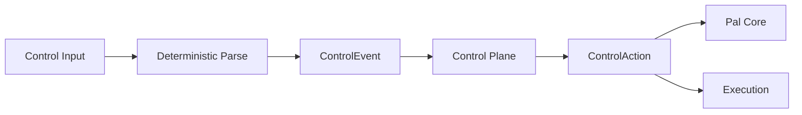
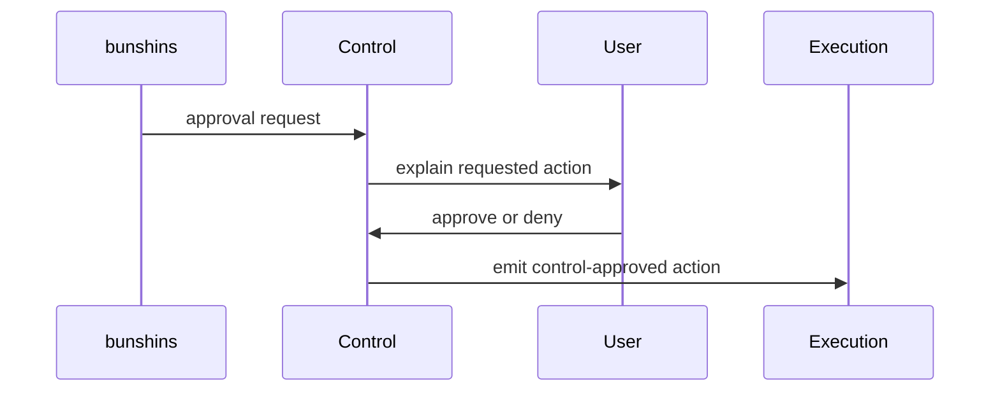

# Pal Control Plane

## Current Implementation Alignment

Registered slash commands are deterministic control-plane ingress. When the slash command name resolves to a registered control command, it bypasses LLM reasoning, prompt assembly, and L1 transcript writes. If a `/...` text does not match any registered command or alias, Control re-emits it as a normal `user.message`; the text then follows the ordinary conversational LLM path instead of producing an "unknown command" reply. Registered commands with invalid arguments are still handled as control errors.

The command parser accepts both direct command text and Telegram bot-addressed command text:

- `/control`
- `/control@PalDevBot`
- `/refresh_llm_endpoint`
- `/refresh_llm_endpoint@PalDevBot`
- `/refresh_tool_surface`
- `/refresh_tool_surface@PalDevBot`

The optional `@BotName` suffix is stripped before command lookup.

`/refresh_llm_endpoint` is a built-in control command. It refreshes LLM endpoint topology from the local database for future turns. It is available in the textual `/control` list, the Telegram command catalog, and the inline control panel as `Refresh LLM`.

`/refresh_tool_surface` is a built-in control command. It reloads `src/pal/core/tool_surface.toml` into the active PalCore instance for future turns. It is available in the textual `/control` list, the Telegram command catalog, and the inline control panel as `Refresh Tools`.

Inline control buttons should use typed actions. Generic command buttons use `control.command.run` with `command_name`; arbitrary module-specific actions use `control.action.dispatch` and carry a typed `ControlAction` payload. Channel endpoints own platform-specific rendering such as Telegram inline keyboards and callback tokens.

> 目标：定义 `control` 的职责、边界和交互契约。

## 目标

`Control` 是 `Pal` 的独立控制平面。

它负责让用户、bunshins 和系统能够通过显式可理解的方式治理 `Pal`，而不是把所有命令都丢进开放式 agent reasoning。

## Position

`Control` 不属于数据面。

它位于：

- `Channel` 之上
- `Execution` 之外
- `Pal Core` 旁边

它为 `Pal Core` 提供确定性的控制动作，而不是自由推理结果。

## Owns

- 显式命令语义
- 审批语义
- pause / resume / cancel / approve 之类的治理动作
- bunshins permission handoff
- system control signal normalization
- deterministic control parsing

## Does Not Own

- tool execution
- general chat reasoning
- durable state storage
- plugin implementation details
- business object truth

## 输入来源

`Control` 的输入固定来自三类来源：

- slash command
- bunshins approval request
- system control signal

可选地，也可以承接：

- 明确的用户自然语言控制句

但进入 `Control` 后，必须先被收敛成明确控制意图，而不是继续走开放式自由推理。

## 核心对象

## ControlEvent

`ControlEvent` 表示进入控制平面的标准化输入。

它至少包含：

- `event_id`
- `event_kind`
- `source_kind`
- `payload`
- `response_handle`
- `correlation_id`
- `created_at`

## ControlAction

`ControlAction` 表示控制平面产出的治理动作。

它至少包含：

- `action_kind`
- `target_scope`
- `target_id`
- `requires_user_confirmation`
- `delivery`
- `notes`

`delivery` is a typed `ControlDelivery` compiled by `control`, not by `core`.
Its `delivery_kind` is one of:

- `reply`
- `interactive_open`
- `interactive_update`
- `interactive_resolve`
- `interactive_expire`
- `endpoint_status`

The runtime path is:

`channel event -> ControlEventHandler/ControlPlane -> ControlAction -> PalCore dispatch -> channel render`

`PalCore` applies state changes and dispatches typed deliveries. Channel endpoints own platform rendering and fallback behavior.

## 运行模型

## Built-in Control Capabilities

以下 capability family 必须是 built-in：

- `control.approve`
- `control.cancel`
- `control.status`
- `control.pause`
- `control.resume`
- `control.mode_switch`

其中：

- `approve` 用于 bunshins 请求权限时的治理中继
- `approve` 不等于业务工具
- `approve` 默认不直接修改业务对象，而是释放某个受控动作的执行权

## Approval Object Contract

`approve` 背后对应的是正式 approval object，而不是瞬时按钮。

它至少应具备这些语义：

- proposal snapshot
- target identity or target digest
- decision lifecycle
- delivery state
- consumed state

approval 的生命周期至少包含：

- pending
- approved
- rejected
- consumed

这保证审批既能被用户理解，也能被 tasking、bunshins replacement、failure reporting 正式引用。

## System Control Channel Boundary

来自系统层的 control signal 可以由 `supervisor` 或其他 runtime component 送入 `Control`。

但这条控制链不承载：

- 正常用户消息
- 正常用户回复
- 普通对话 turn payload

也就是说，控制面可以接系统信号，但不能退化成“万能消息总线”。

## bunshins Approval Flow

## Control 与其他模块的关系

### 与 Channel

- `Channel` 负责接收和发送
- `Control` 负责解释显式控制语义

### 与 Core

- `Core` 消费 `ControlAction`
- `Control` 不代替 `Core` 做全局协调

### 与 Execution

- `Control` 不直接实施副作用
- `Control` 产生受治理的执行许可或状态变更请求
- 真正的 effect 仍然经 `Execution`

## Determinism 原则

`Control` 默认走 deterministic path。

这意味着：

- 优先命令语法
- 优先显式模式切换
- 优先确定性参数解析
- 避免把已注册控制命令交给开放式自由生成
- 未匹配任何已注册 command 的 `/...` 文本不是控制命令，应回落为普通用户消息

## Invariants

- `Control` 是独立控制平面。
- `Control` 不属于数据面。
- `Control` 不直接实施副作用。
- `approve` 是 built-in control capability。
- bunshins approval 必须通过 `Control`。
- `Control` 默认走 deterministic path。
- 只有匹配到已注册 command 或 alias 的 slash-like 输入才被消费为控制命令。
- 未匹配的 `/...` 输入必须回落为普通 `user.message`，不能被 control path 截断成 unknown-command reply。
- approval 是正式对象，不是瞬时 UI 动作。

## Non-Goals

- 不在本文件定义命令行或 UI 细节
- 不在本文件定义具体审批页面
- 不让 `Control` 取代普通业务 capability
- 不让 `Control` 承担开放式聊天推理
