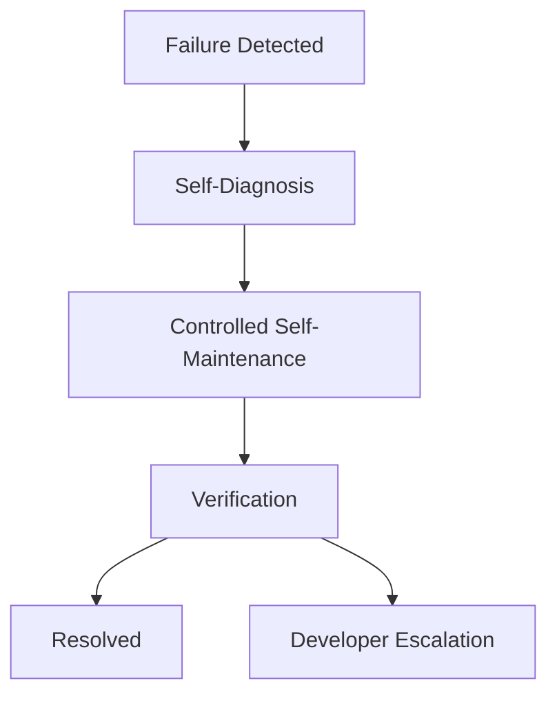

# Pal Failure Reporting Contract

> 目标：把“修不好怎么办”写成正式契约。

## 目标

`Pal` 不是只会报错的黑箱。

当失败发生时，系统必须沿着受约束的阶梯升级：

1. self-observation
2. self-diagnosis
3. self-maintenance
4. developer escalation

## 失败升级阶梯

## 允许自诊断的情况

以下情况允许 `Pal` 直接进入 self-diagnosis：

- 子系统健康状态异常
- provider 不可用
- 插件加载失败
- bunshin 或 proactive 流程阻塞
- memory recall 或 execution 路径异常
- channel delivery 失败

## 允许进入 Self-Maintenance 的情况

以下情况允许 `Pal` 创建 maintenance task 并尝试受控修复：

- 问题已被定位到某个子系统或 provider
- 风险不触及 identity / policy 边界
- 可通过 plugin reload、provider swap、受控 patch、schema repair、component re-register 解决
- 修复动作可以被验证和回滚

## 必须升级为 Developer Escalation 的情况

以下情况必须报告给开发者，而不能继续自修：

- 修复动作触及核心 identity、policy、constitutional boundary
- introspection 无法定位问题
- 多次自维护尝试失败
- 修复后验证失败且无法安全回滚
- durable data 可能损坏
- 需要人类做架构级决策
- 修复流程被 `Pal` 自行停止后仍未解决
- 修复流程被 `Control` 显式停止后仍未解决

## 报告对象

developer report 是结构化对象，不是随口自然语言抱怨。

它必须至少包含：

- `report_id`
- `subsystem`
- `component`
- `severity`
- `failure_kind`
- `why_blocked`
- `current_blocker`
- `impact`
- `attempted_actions`
- `evidence`
- `documents_checked`
- `possible_solutions`
- `safe_to_retry`
- `requires_developer_action`
- `recommended_next_step`
- `related_ids`

## 字段语义

## `report_id`

唯一报告标识。

## `subsystem`

失败所属子系统。

允许值例如：

- `channel`
- `memory`
- `execution`
- `control`
- `tasking`
- `proactive`
- `plugin`

## `component`

更细粒度的组件名，例如：

- provider id
- plugin id
- scheduler
- bunshin adapter

## `severity`

建议固定为：

- `low`
- `medium`
- `high`
- `critical`

## `failure_kind`

失败类别，例如：

- provider_failure
- routing_failure
- schema_failure
- delivery_failure
- maintenance_failure

## `why_blocked`

一句话说明为什么这次流程没有完成。

## `current_blocker`

当前最小但真实的卡点。

## `impact`

说明影响范围，例如：

- 当前请求失败
- 某个插件不可用
- recall 降级
- scheduler 暂停

## `attempted_actions`

已经尝试过的动作列表。

## `evidence`

结构化证据，例如：

- stack traces
- state snapshots
- health reports
- validation results

## `documents_checked`

已检查的相关文档、配置、日志或对象。

## `possible_solutions`

当前可行的下一步候选。

## `safe_to_retry`

布尔字段，表示是否允许安全重试。

## `requires_developer_action`

布尔字段，表示是否必须由开发者继续接手。

## `recommended_next_step`

推荐给开发者的下一步动作。

## `related_ids`

相关对象标识集合，例如：

- `conversation_id`
- `task_id`
- `work_order_id`
- `proactive_id`
- `proactive_run_id`

## 用户反馈与开发者报告分离

系统必须区分两层输出：

- 用户反馈
- 开发者报告

用户反馈要求：

- 简明
- 可理解
- 说明已尝试什么
- 说明当前卡点
- 说明建议下一步

开发者报告要求：

- 结构化
- 可追溯
- 可定位
- 可用于后续排障和复盘

## 与修复后记忆沉淀的关系

如果问题被成功修复，则优先沉淀 system memory，而不是生成 developer escalation report。

只有在：

- 问题仍未解决
- 或修复流程被停止但未完成

的情况下，才进入正式 failure reporting。

## 与现有 Diagnostics 的关系

当前仓库里的 diagnostics 结构可以作为起点，但在新架构中必须升级为正式契约，而不是仅供渲染的失败摘要。

## Invariants

- 失败必须沿 self-diagnosis -> self-maintenance -> developer escalation 阶梯升级。
- 不可自修的问题必须报告给开发者。
- developer report 必须是结构化对象。
- 用户反馈和开发者报告必须分离。
- 报告必须包含 attempted actions 与 evidence。

## Non-Goals

- 不在本文件定义日志存储实现
- 不在本文件定义具体 UI 呈现
- 不允许用一段自然语言替代 developer report
