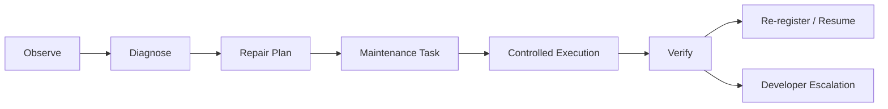

# Pal Introspection Contract

> 目标：把 `introspection` 写成 `Pal` 的正式元能力层。

## 目标

`introspection` 不是几个零散 debug 接口。

它是 `Pal` 的统一镜像层，用来支撑：

- self-observation
- self-diagnosis
- controlled self-modification
- self-maintenance
- self-extension

它同时也是 `Pal` 的最小内置能力面之一。

## 定位

`introspection` 是 built-in meta capability family。

它的作用不是替代业务 capability，而是为每个子系统提供统一的：

- observe
- modify
- debug
- extend

接口面。

此外，还应有一个 built-in 聚合入口：

- `introspection.self_diagnose`

## 统一镜像层原则

每个子系统都必须注册 introspection surface。

建议统一命名为：

- `introspection.core.*`
- `introspection.channel.*`
- `introspection.memory.*`
- `introspection.execution.*`
- `introspection.control.*`
- `introspection.tasking.*`
- `introspection.proactive.*`
- `introspection.plugin.*`
- `introspection.llm.*`

## 每个 surface 的最小集合

每个子系统至少提供：

- `observe`
- `modify`
- `debug`
- `extend`

这些能力既是各子系统的内省接口，也是 `Pal` 做自检、自诊断、自维护规划的输入面。

### observe

用于：

- status
- health
- current config
- pending work
- recent failures
- effective runtime state

### modify

用于：

- 受限状态调整
- 受限配置更新
- 受限恢复动作

### debug

用于：

- self diagnose
- evidence collection
- bounded internal inspection
- fault localization

### extend

用于：

- plugin install / unload
- provider reload
- provider rebind
- component re-registration

## Monitoring Contract

每个子系统都必须暴露 monitoring surface。

至少包含：

- `health`
- `status`
- `degraded_reason`
- `pending_work`
- `recent_failures`
- `last_success_at`
- `last_error_at`

如果子系统有 provider 或 plugin 依赖，还应暴露：

- `active_provider`
- `provider_version`
- `dependency_status`

## `self_diagnose` 聚合规则

`introspection.self_diagnose` 应：

1. 先检查 `Pal` 自身最小运行状态
2. 再聚合各子系统 monitoring surface
3. 统一给出：
   - 正常
   - degraded
   - blocked
   - needs_repair
   - escalate

它不是新的子系统，而是 introspection 家族内部的聚合诊断入口。

## Self-Maintenance Loop

`Pal` 支持完整的 self-maintenance loop，但必须走治理路径。

它可以：

- 看见问题
- 诊断问题
- 制定修复方案
- 创建 maintenance task
- 调用 minions 修复组件
- 验证结果
- 重新注册组件
- 回滚失败组件

### 停止与收尾

self-maintenance 不需要预先写死成脚本化 stop conditions。

停止可以来自两种来源：

- `Pal` 自己判断当前修复尝试已无法继续安全推进
- `Control` 显式介入并停止当前修复流程

一旦停止：

- 如果问题已解决，则进入修复后沉淀
- 如果问题未解决，则进入 developer escalation

### 修复后沉淀

当一次修复被验证成功后，`Pal` 应尽量把可复用的修理经验沉淀为 system memory。

推荐沉淀内容包括：

- 问题现象
- 诊断线索
- 修复动作
- 验证结果

这样做的目的不是做日志归档，而是：

- 让未来相似问题可被 recall
- 让 `Pal` 的自维护能力形成可积累经验
- 避免每次自修都从零开始排查

这些沉淀可进入 `L3` 的 system-scoped fact 或 case。

## 边界

`introspection` 虽然强，但不是后门。

它不能越过：

- core policy
- identity contract
- persona boundary
- constitutional constraints

因此：

- 不允许通过 introspection 改写主体身份
- 不允许通过 introspection 注入新人格
- 不允许通过 introspection 绕过审批与安全边界

## 与 Execution 的关系

所有 introspection surface 都必须注册到 `Execution` 的 introspection index。

这意味着：

- introspection 通过 capability surface 暴露
- 真正 effect 仍要落到 `Tool`
- introspection 的 modify/debug/extend 也受 validator pipeline 约束

## 与 Failure Reporting 的关系

当 introspection 判断：

- 问题不可自动修复
- 风险超出治理边界
- 自维护尝试失败

或者：

- 修复流程被停止后仍未解决

则必须触发 developer escalation，并产出统一报告。

## Invariants

- `introspection` 是统一镜像层。
- 每个子系统都必须注册 introspection surface。
- 每个 surface 至少提供 `observe / modify / debug / extend`。
- introspection 支持 self-maintenance，但不是无约束后门。
- introspection 不能突破 identity / policy / constitutional boundary。

## Non-Goals

- 不在本文件定义每个子系统的所有私有字段
- 不把 introspection 变成普通业务调用入口
- 不允许 introspection 替代审批机制
