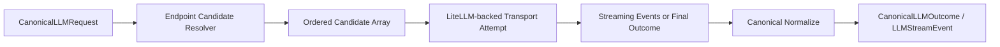

# Pal LLM Contract

> 目标：定义 `llm` 子系统的职责、canonical shape、streaming 契约，以及本地模型路由注册表。

## 目标

`llm` 子系统负责让 `Pal` 以稳定、可切换、可流式、可回退的方式调用外部模型。

它继承旧版本里已经稳定的语义：

- 内部使用 canonical request / outcome shape
- 外部 provider 只负责 wire shape 适配
- provider native tool calling 只是协议壳
- 真正的 tool 执行仍然回到本地 `Execution`

在新架构里，`llm` 的实现策略收口为：

- 保留旧版 canonical shape 语义
- 用 `LiteLLM` 统一大部分 provider transport
- 把模型能力与路由优先级收敛到本地数据库
- 把 streaming 提升为第一公民

## Owns

- canonical request / outcome / stream event shape
- provider transport normalization
- model route selection
- fallback candidate building
- streaming assembly and forwarding
- request timeout / retry boundary
- model capability registry read path

## Does Not Own

- durable business state
- tool execution
- capability governance
- control decisions
- memory ranking

## Multimodal Serialization Boundary

`llm` is the final provider-wire serialization boundary for multimodal content.

Internal prompt messages may contain typed content parts such as `artifact_image`. These are not provider payloads. During LiteLLM invocation, `llm` asks the artifact manager for the normalized representation and converts the part into a provider-compatible `image_url` data URL only when the selected endpoint advertises vision support.

Rules:

- `PromptCompiler` emits provider-neutral prompt IR and message parts.
- `PalCore` supplies endpoint capability facts such as `supports_vision`.
- `ArtifactManager` owns normalized artifact representations.
- `LLMRuntime` owns conversion to LiteLLM/OpenAI-style wire format.
- Non-vision endpoints must not crash on image parts; they receive text guidance instead.

See [artifact_manager.md](artifact_manager.md).

## 设计结论

### 保留旧版 canonical shape

`llm` 内部仍然维持 vendor-agnostic canonical objects。

至少包括：

- `CanonicalLLMRequest`
- `CanonicalLLMOutcome`
- `CanonicalToolDefinition`
- `CanonicalToolCall`
- `CanonicalToolResult`
- `LLMStreamEvent`

### 使用 LiteLLM 统一 transport

`LiteLLM` 在新架构中的定位是：

- provider transport unifier
- request / response wire adapter
- streaming wire adapter
- fallback transport helper

`LiteLLM` 不是：

- `Pal` 的能力真相源
- `Pal` 的 policy source
- `Pal` 的模型元信息真相源

也就是说：

- canonical shape 仍然由 `Pal` 定义
- route selection 仍然由 `Pal` 决定
- model capability metadata 仍然由 `Pal` 本地注册表维护
- `LiteLLM` 只负责把 canonical request 变成 provider call

## 运行模型

## Streaming First

streaming 是 `llm` 子系统的硬要求。

这意味着：

- `llm.stream()` 必须是一等接口
- runtime 不接受“整段生成后再伪装成 delta”的假 streaming
- provider stream 必须先在 `llm` 内部被消费、组装和规范化
- tool calling / reasoning / plain text 都必须适配统一 stream event shape

这里的 streaming 指的是：

- provider-facing streaming
- runtime-internal streaming

它不等于：

- user-visible raw delta streaming
- 直接把半成品消息旁路发给 channel

### `LLMStreamEvent`

推荐最小事件集合：

- `message_start`
- `delta`
- `tool_call_delta`
- `message_end`
- `done`
- `error`

其中：

- `delta` 表示普通文本增量
- `tool_call_delta` 表示 provider 原生 tool call 流的规范化增量
- `done` 表示该次流结束

## Streaming Assembly Rule

provider stream 的 chunk 不应直接进入 `Pal Core` 主循环。

正确路径是：

1. provider chunk 进入 `llm`
2. `llm` 内部维护 stream state
3. 文本、tool call、finish reason、usage 在 `llm` 内部被组装
4. stream 完成后生成最终 `CanonicalLLMOutcome`
5. 只有最终 outcome 才进入 `Pal Core`

也就是说：

- stream chunk 不是业务事件
- final normalized outcome 才是主循环的正式输入

这样可以避免：

- 半截 tool call 进入 execution
- memory / control / execution 处理不完整结果
- channel 端提前收到半成品内容

## User-Facing Streaming Policy

默认情况下，provider streaming 不应直接映射成用户可见的 raw delta output。

对于 IM channel，推荐的前台体验是：

- typing indicator
- generating status
- 短状态提示

而不是：

- 直接旁路发送半截文本
- 频繁 edit 同一条消息
- 在 channel 层自行拼接 provider chunk

这样做的原因是：

- IM channel 常有分段、频率、格式和截断限制
- 半成品 Markdown / code block / emoji 很容易显示异常
- 某些 channel 的 edit/send 行为会引入明显闪烁或截断

因此，默认策略固定为：

- `llm` 内部完整收流
- `Pal Core` 处理最终 outcome
- `channel` 端仅暴露 typing / status 提示
- 最终回复按 channel 规则一次性或分段发送成品内容

## Endpoint Registry

`llm` 的路由与能力信息不应在运行时临时拼装。

它们应通过 setup / refresh 流程维护在本地数据库中。

新架构中，推荐继续使用并扩展现有 `llm_endpoints` 表，把它视为：

- 本地模型路由注册表
- 本地模型能力描述表
- fallback 候选构建源

### 为什么不完全依赖 provider 元信息

因为 provider 或聚合层通常无法稳定提供完整、统一、可依赖的模型能力元数据。

例如：

- `context_window`
- `max_output_tokens`
- `supports_reasoning`
- `supports_tools`
- `supports_streaming`
- 特殊 auth 方式

这些都更适合作为 `Pal` 自己维护的本地 registry。

## `llm_endpoints` 推荐字段

每一行表示一个可调用的 endpoint candidate。

推荐字段：

- `endpoint_id`
- `provider`
- `model_id`
- `display_name`
- `api_mode`
- `base_url`
- `auth_kind`
- `credential_ref`
- `context_window`
- `max_output_tokens`
- `supports_reasoning`
- `supports_tools`
- `supports_streaming`
- `input_modalities_blob`
- `output_modalities_blob`
- `priority`
- `enabled`
- `capabilities_blob`
- `notes`
- `created_at`
- `updated_at`

字段说明：

- `auth_kind` 至少支持：
  - `api_key_ref`
  - `oauth`
  - `local_provider_auth`
- `credential_ref` 指向 keychain ref、oauth account ref 或 provider-specific auth handle
- `priority` 用于构造 fallback 顺序
- `capabilities_blob` 用于承接额外 provider-specific 元信息，但不替代核心列

## Setup / Refresh 流程

`llm` registry 必须可更新。

推荐流程：

1. setup 写入默认 endpoint rows
2. refresh 命令更新已知模型能力字段
3. 用户可手动启用、禁用、排序、补充 metadata
4. runtime 只读取本地 registry，不依赖在线发现

### Update Contract

`llm` 子系统至少需要一个显式更新入口，用于：

- 刷新模型能力元信息
- 调整优先级
- 更新 auth 方式或 credential ref
- 变更 base_url
- 标记 deprecation / disable

## Fallback 设计

fallback 的真相源是本地 registry，不是代码里硬编码的 provider 名称列表。

`llm` 是典型的 fallback-capable provider family。

也就是说：

- 它适合 ordered candidates + priority + fallback
- 它不应和 embedding 这类 migration-only provider 混用同一种抽象

### Candidate Array

每次请求开始时，`llm` 应构造一个有序 candidate array。

构造步骤：

1. 读取全部 enabled rows
2. 按请求所需能力过滤：
   - 是否要求 `streaming`
   - 是否要求 `tools`
   - 是否要求 `reasoning`
   - 是否要求某种 `api_mode`
3. 按 `priority` 排序
4. 生成本轮 `LLMRouteCandidate[]`

然后：

- 依次尝试每个 candidate
- 失败时按错误类型决定是否继续 fallback
- 最终把失败链写进 diagnostics / debug log

## Tool Calling Boundary

provider native tool calling 在 `llm` 侧只负责：

- 承载 tool schema
- 承载 tool call wire shape
- 承载 tool result wire shape

它不能负责：

- 真正的 tool execution
- capability policy
- tool governance

这条边界与旧版本保持完全对齐。

## Auth Contract

`llm` 子系统必须支持多种授权方式，而不假定只有 API key。

至少包括：

- API key via keychain ref
- OAuth-backed provider authorization
- provider-local auth handle

因此，endpoint row 不应只保存 `keychain_ref`，而应表达：

- auth kind
- credential ref
- provider-specific auth metadata

## Invariants

- `llm` 内部必须保持 canonical shape。
- `LiteLLM` 只负责 transport normalization，不拥有 `Pal` 的模型能力真相。
- streaming 是第一公民，不接受伪 streaming。
- stream chunk 不直接进入 `Pal Core` 主循环。
- user-visible raw delta streaming 默认关闭，IM 前台优先使用 typing/status 提示。
- provider native tool calling 不能绕过本地 `Execution`。
- fallback 顺序来自本地数据库中的 candidate array，而不是硬编码列表。
- 模型能力元信息必须可更新。

## Non-Goals

- 不在本文件定义具体 provider SDK 代码
- 不在本文件承诺所有模型能力都能自动在线发现
- 不在本文件定义 UI 级模型选择器
- 不让 `LiteLLM` 取代 `Pal` 的 canonical protocol
