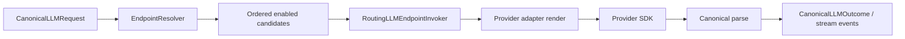

# Pal LLM Contract

This document defines the LLM subsystem boundary, the canonical request/outcome
shape, endpoint routing, provider rendering, streaming assembly, and fallback
semantics.

## Purpose

The `llm` subsystem lets Pal call external models through a stable internal
protocol while preserving provider-specific wire semantics at the rendering
boundary.

The core rule is:

- Pal owns the canonical IR.
- Provider adapters own provider wire rendering.
- Endpoint routing and fallback are driven by Pal's local endpoint registry.
- Tool execution always returns to local `Execution`.

## Owns

- `CanonicalLLMRequest`, `CanonicalLLMOutcome`, `CanonicalToolDefinition`,
  `CanonicalToolCall`, and normalized stream events.
- Endpoint resolution and fallback candidate iteration.
- Provider request rendering through `llm_adaptor`.
- Native provider invocation where Pal has a better first-party transport.
- OpenAI SDK invocation for OpenAI-compatible/chat-completions style providers.
- Streaming assembly into complete canonical outcomes.
- Credential lookup through endpoint metadata.
- Model capability read path from the local endpoint registry.

## Does Not Own

- Durable conversation state.
- Memory ranking or memory commit policy.
- Tool execution.
- Capability governance.
- Control-plane decisions.
- Channel-specific delivery UX.

## Canonical IR

The input to `llm` is provider-neutral message IR. It may contain roles such as
`system`, `developer`, `user`, `assistant`, and `tool`, plus structured tool
definitions and canonical tool-call records.

This IR is not assumed to be a valid payload for every provider. It is rendered
late, after endpoint selection, by the selected provider adapter.

Canonical function tool definitions carry their argument JSON Schema in
`function.input_schema`. Provider adapters render that field as
`function.parameters` for OpenAI Chat, `parameters` for OpenAI Responses,
`input_schema` for Anthropic, or `inputSchema` for the Codex bridge. Tool
descriptions do not repeat the input schema.

Important transcript rules:

- An assistant message with empty text and non-empty `tool_calls` is valid.
- A tool result must be paired with a preceding assistant tool-call header.
- Empty assistant text with no tool calls is malformed response data and should
  be rejected or normalized at the response boundary, not by dropping valid
  transcript entries later.
- L1 stores Pal's IR-level conversation records; provider-specific renderings
  are not L1 truth.
- Provider-exact continuation fields, including reasoning content required by
  a tool-call follow-up, live only in the active logical turn and its restart
  checkpoint. Once the turn closes, L1 renders the closed tool interaction as
  provider-neutral historical context rather than replaying provider tool
  envelopes.

## Endpoint Registry

`llm_endpoints` is the local source of truth for callable model candidates.
Each row represents one endpoint candidate.

Important fields:

- `endpoint_id`
- `provider`
- `model_id`
- `display_name`
- `api_mode`
- `base_url`
- `auth_kind`
- `credential_ref`
- `context_window`
- `max_output_tokens`
- `supports_reasoning`
- `supports_tools`
- `supports_streaming`
- `supports_vision`
- `input_modalities_blob`
- `output_modalities_blob`
- `priority`
- `enabled`
- `capabilities_blob`
- `notes`

`max_output_tokens` is the endpoint's ordinary per-request default. An endpoint
may opt into output-limit recovery with
`capabilities_blob.max_output_recovery = {enabled, upper_limit,
max_continuations}`. The upper limit is exceptional recovery capacity, not the
default reservation used by every turn.

`provider` is the primary semantic routing key. `capabilities_blob.adapter` or
`capabilities_blob.llm_adapter` may force a specific adapter when provider alone
is insufficient.

`priority` is ascending:

- `0` is tried before `1`.
- Ties should use stable secondary ordering such as `endpoint_id`.
- Prefer small non-negative integers.
- Do not use priority as a model-quality score where larger means better.

## Routing Model



The current routing invoker chooses a concrete native transport by endpoint
shape:

1. Codex CLI bridge when the endpoint is marked as Codex-native/bridge.
2. Native OpenAI Responses SDK for OpenAI Responses-shaped endpoints.
3. Native Anthropic Messages SDK for Anthropic endpoints.
4. Native OpenAI Chat Completions SDK for OpenAI-compatible chat endpoints.

Provider SDKs are transport details; they are not the owner of Pal's canonical
protocol.

## Provider Adapter Registry

Provider rendering lives under `src/pal/llm/llm_adaptor/`.

Built-in adapters:

- `OpenAIResponsesProvider`
- `OpenAIChatProvider`
- `CodexBridgeProvider`
- `AnthropicMessagesProvider`
- `DeepSeekProvider`
- `ZaiGLMProvider`

Adapters are resolved by:

1. explicit adapter name from endpoint capabilities
2. provider name
3. adapter-specific endpoint matcher
4. default OpenAI-compatible chat adapter

Runtime extension points:

- Python entry point group: `pal.llm_provider_adapters`
- Runtime adapter directory: `<runtime_root>/llm/adapters`
- Legacy runtime adapter directory: `<runtime_root>/llm_provider_adapters`

Runtime adapters must export one or more `LLMProviderAdapter` subclasses,
directly or through `ADAPTER` / `ADAPTERS`.

## Thinking Levels

Thinking levels are provider-owned endpoint capabilities, not a Pal-wide enum.
An adapter returns an immutable `ThinkingContract` from
`provider_thinking_contract()`. The contract declares the choices exposed to
the user, their aliases, and the provider default. The adapter then projects
the resolved choice into its wire request in `apply_request()`.

Selections are persisted under the endpoint ID. Switching models restores that
endpoint's prior selection, and a fallback endpoint uses its own selection.
The `/think` control is rendered from the active endpoint's contract; endpoints
without a contract do not expose configurable thinking.

An endpoint may narrow a provider contract with
`capabilities_blob.thinking_contract`, but it cannot invent a choice the
provider adapter cannot project:

```json
{
  "thinking_contract": {
    "default": "high",
    "choices": [
      "off",
      {"id": "high", "label": "focused", "aliases": ["deep"]}
    ]
  }
}
```

## Wire Shapes

Pal currently recognizes three main provider shape families.

### OpenAI Responses

OpenAI Responses-shaped endpoints render to `input` items and are invoked with
the native OpenAI SDK when supported by the routing layer.

Rendering rules:

- `system` and `developer` IR messages become Responses `developer` input items.
- User content becomes Responses user input content.
- Assistant content becomes Responses assistant message output content.
- Assistant tool calls become Responses `function_call` items.
- Tool results become `function_call_output` items.
- Think level maps to `reasoning.effort` when supported.

### OpenAI Chat Completions

OpenAI-compatible chat endpoints render to chat-completions-style `messages`.
Most provider overrides still use this shape through the OpenAI SDK with the
endpoint's configured `base_url`.

Rendering rules:

- A leading `system` message may remain a `system` message.
- `developer` is only preserved if the adapter explicitly supports it.
- Later `system` or unsupported `developer` messages are rendered as tagged
  user instruction fallback messages, preserving conversation order.
- Assistant tool-call headers must be preserved even when assistant content is
  empty.

### Anthropic Messages

Anthropic endpoints use the native Anthropic SDK.

Rendering rules:

- Leading `system` content is moved to the Anthropic `system` parameter.
- Later `system` or `developer` instructions become tagged user instruction
  fallback messages.
- Assistant tool calls become Anthropic `tool_use` blocks.
- Tool results become Anthropic `tool_result` blocks.
- Think level maps to Anthropic `thinking` budget when compatible with the
  requested max output token budget.
- `CanonicalLLMRequest.thinking_budget_tokens` may explicitly override that
  budget and is clamped below `max_output_tokens`. Providers without a numeric
  thinking-budget parameter must not receive it.

## Output-Limit Recovery

Output-limit recovery belongs to the shared endpoint runtime, before a result
is visible to Pal Core or Minion. For an opted-in endpoint:

1. A `length`, `max_tokens`, `max_output_tokens`, or
   `model_context_window_exceeded` result is buffered and no tool call from it
   is executable.
2. If the request used the endpoint default below `upper_limit`, the same
   request is retried once at the upper limit and the first partial result is
   discarded.
3. If the upper-limit response is still truncated, the runtime may append a
   bounded continuation turn asking the model to resume directly and split the
   remaining work into smaller pieces.
4. Only tool calls from a non-truncated final response are returned. If the
   continuation budget is exhausted, partial text may be returned with the
   truncation finish reason, but all partial tool calls are removed.

Requests intentionally below the endpoint default, such as compact summaries,
do not opt into escalation unless their metadata explicitly enables it.

## Provider Overrides

Provider-specific quirks should live in adapters, not in L1 records or prompt
assembly.

Examples:

- DeepSeek V4 thinking-capable endpoints expose only the effective `off`,
  `high`, and `max` choices, default to `high`, and set both
  `reasoning_effort` and `extra_body.thinking`. Compatibility aliases resolve
  `low`/`medium` to `high` and `xhigh` to `max`; thinking requests omit
  `tool_choice` as required by the provider.
- Z.ai/GLM OpenAI-shaped endpoints expose the effective `off`, `high`, and
  `max` choices and set both `reasoning_effort` and `extra_body.thinking`.
  Older Pal aliases are resolved by that provider contract rather than sent
  verbatim.
- Codex bridge endpoints render Responses-shaped payloads while preserving the
  bridge-specific invocation path.

Provider overrides should be narrow: they may alter wire shape, model provider
prefixes, reasoning parameters, tool schema shape, and provider-specific
request body additions. They should not rewrite Pal's canonical transcript
semantics.

## Multimodal Serialization Boundary

`llm` is the final provider-wire serialization boundary for multimodal content.

Internal prompt messages may contain provider-neutral content parts such as
artifact images. During provider rendering, the selected endpoint's capability
facts determine whether those parts become image payloads or text guidance.

Rules:

- Prompt assembly emits provider-neutral IR.
- Endpoint metadata supplies facts such as `supports_vision`.
- The artifact manager owns normalized artifact representations.
- `llm` owns conversion into provider-compatible image payloads.
- Non-vision endpoints must receive safe text guidance instead of crashing.

See [artifact_manager.md](artifact_manager.md).

## Streaming

Streaming is a first-class internal contract, but provider stream chunks do not
enter Pal Core directly.

Correct path:

1. Provider chunks enter `llm`.
2. `llm` maintains stream assembly state.
3. Text, tool calls, finish reason, and usage are assembled inside `llm`.
4. The assembled canonical outcome is returned to Pal Core.

Default user-facing policy:

- IM channels should prefer typing/status indicators while generation runs.
- Raw provider deltas are not directly exposed as chat messages by default.
- Final output is sent through normal channel formatting and delivery rules.

## Tool Calling Boundary

Provider-native tool calling is only a wire protocol.

It may carry:

- tool schemas
- assistant tool-call intent
- tool-result messages

It may not own:

- real tool execution
- capability policy
- approval
- governance

All tool execution returns to Pal's local `Execution` runtime. When a model emits
multiple tool calls in one assistant response, Pal executes that batch and then
flushes the assistant tool-call header plus all tool results back into the next
LLM request.

## Fallback

Fallback candidates come from the local endpoint registry.

Request-time candidate construction should:

1. read enabled endpoint rows
2. filter by required capabilities such as tools, reasoning, streaming, and
   modalities
3. sort by ascending `priority`
4. try candidates in order
5. record the failure chain for diagnostics

Provider fallback must not mutate the transcript to hide protocol errors. If a
provider returns malformed output, the response boundary should classify or
normalize that failure before the next LLM turn is built.

## Invariants

- Pal keeps provider-neutral canonical LLM IR internally.
- Provider adapters are the only layer that should perform provider wire-shape
  corrections.
- L1 stores IR, not provider payloads.
- OpenAI-compatible and Anthropic endpoints use native SDK invokers selected by
  endpoint metadata.
- Streaming chunks are assembled before they affect the main turn loop.
- Tool calling cannot bypass local `Execution`.
- Fallback order comes from endpoint registry priority.
- Model capability metadata must be refreshable and inspectable.

## Non-Goals

- This contract does not define a UI model picker.
- This contract does not require online provider model discovery.
- This contract does not make any provider SDK Pal's source of truth.
- This contract does not allow provider adapters to mutate durable conversation
  semantics.
