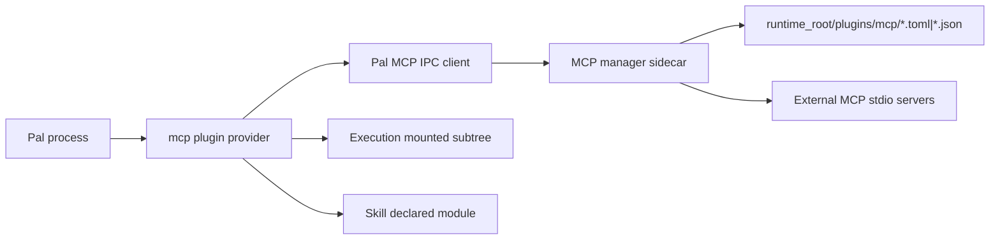

# Pal MCP Contract

This document describes the current `pal.mcp` implementation.

## Boundary

MCP is an external protocol adapter, not a Pal core model.

PalCore does not understand MCP tools, prompts, stdio framing, cursors, server sessions, or child process details. PalCore only sees a detachable plugin that publishes Pal-native capabilities and declared skills.

Current boundary:

- `pal.mcp.manager` owns MCP server config discovery, stdio sessions, live discovery, calls, prompt rendering, and server lifecycle.
- `pal.mcp.plugin` owns the first-party detachable plugin that starts/stops the manager sidecar and publishes projections.
- `pal.mcp.compiler` compiles MCP runtime projections into Pal-native capability descriptors and declared skill descriptors.
- `Execution` owns capability registry, mounting, dispatch, and discovery.
- `SkillService` owns declared skill registration/removal.

MCP server tools and prompts are runtime projection, not durable truth. Persist server config, not the discovered tool/prompt list.

## Process Model

The MCP manager runs as a first-party sidecar process started by the MCP plugin.



The sidecar isolates MCP stdio/process/session complexity from Pal. If MCP servers are slow or broken, the failure should stay in the MCP manager/plugin boundary.

## Config Discovery

Config root:

```text
runtime_root/plugins/mcp/
```

Supported files:

- `*.toml`
- `*.json`

Supported shapes:

- One server per file with `server_id`, `command`, optional `args`, and timeout fields.
- JSON-style `mcpServers` object for compatibility.

Template:

```text
src/pal/mcp/templates/stdio_server.toml
```

Current defaults:

- `startup_timeout_ms = 10000`
- `request_timeout_ms = 300000`
- `shutdown_timeout_ms = 5000`
- Pal-to-manager IPC request timeout: `300s`

## Lifecycle

### Attach Manager

`op_module_mcp_attach` starts the sidecar, asks it to rescan config, fetches discovery snapshots, compiles projections, and refreshes the module capability/skill publication.

### Rescan

`op_module_mcp_rescan` makes the manager reread `runtime_root/plugins/mcp`, attach enabled servers, detach removed/disabled servers, rediscover tools/prompts, and refresh the Pal projection.

### Detach Manager

`op_module_mcp_detach` stops the sidecar, clears the projection, unpublishes MCP capabilities, and unregisters declared MCP skills.

### Per-Server Attach/Detach

The plugin also exposes management capabilities for one configured MCP server:

- attach one server
- detach one server
- list configured servers
- read one server metadata and snapshot

## Tool Compilation

MCP tool:

```text
server_id + tool.name
```

compiles to:

```text
op_mcp_<server>_tool_<tool>
```

The MCP external tool name is preserved in metadata. The Pal canonical path is generated with underscore-safe names to avoid collisions across servers.

Tool schema rules:

- Valid object `inputSchema` is normalized and passed through.
- Missing schema is allowed by compatibility policy and becomes an empty object schema with `additionalProperties: false`.
- Invalid or non-object schema is rejected. Rejected tools are recorded in snapshot diagnostics and are not exposed as executable capabilities.

Tool result rules:

- MCP `isError=true` is a tool execution error, not a protocol error.
- Protocol/transport/session failures are protocol errors.
- Tool error text is preserved in `CapabilityResult.text`, `structured.tool_text`, and `llm_text`.

## Prompt Compilation

MCP prompt:

```text
server_id + prompt.name
```

compiles to:

```text
skill_id: mcp_<server>_prompt_<prompt>
render capability: op_mcp_<server>_prompt_<prompt>_render
```

Prompt arguments are compiled to a string-based object schema. MCP prompt arguments are not treated as full JSON Schema.

MCP prompt skills are external declared skills:

- origin: MCP
- trust: external
- resident: false
- auto-inject: false
- requires render capability

Rendered prompt content is external procedure content. It must not be treated as system or developer instructions.

Prompt render results preserve MCP messages in structured output. Non-text content types are kept in `unsupported_content_types`; V1 does not silently flatten or drop them.

## Introspection And Operations

The MCP plugin exposes:

- module status
- configured server list
- per-server metadata/snapshot read
- manager attach/detach/rescan
- per-server attach/detach
- `op_mcp_image_prepare`

`op_mcp_image_prepare` prepares image artifact/path/url inputs for MCP tool arguments as URL, local path, base64, or data URL. It is a bridge helper for external MCP tools; it is not a general OCR or image-understanding capability.

## Safety

MCP annotations are hints, not policy truth.

External MCP capabilities must still go through Pal execution, discovery, approval, and risk policy. MCP must not bypass capability governance.
