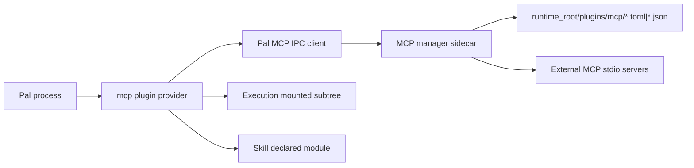

# Pal MCP Contract

This document describes the current `pal.mcp` implementation.

## Boundary

Pal plugins are the primary integration path. MCP is a strict external adapter for
conforming services; service-specific compatibility belongs in a Pal plugin.
Pal supports MCP **2025-06-18** only. Unsupported negotiated versions fail attachment.

PalCore does not understand MCP tools, prompts, stdio framing, cursors, server sessions, or child process details. PalCore only sees a detachable plugin that publishes Pal-native capabilities and declared skills.

Current boundary:

- `pal.mcp.manager` owns MCP server config discovery, stdio sessions, live discovery, calls, prompt rendering, and server lifecycle.
- `pal.mcp.plugin` owns the first-party detachable plugin that starts/stops the manager sidecar and publishes projections.
- `pal.mcp.compiler` compiles MCP runtime projections into Pal-native capability descriptors and declared skill descriptors.
- `Execution` owns capability registry, mounting, dispatch, and discovery.
- `SkillService` owns declared skill registration/removal.

MCP server tools and prompts are runtime projection, not durable truth. Persist server config, not the discovered tool/prompt list.

## Process Model

The MCP manager runs as a first-party sidecar process started by the MCP plugin.


```mermaid
flowchart LR
    PAL["Pal process"] --> PLUGIN["mcp plugin provider"]
    PLUGIN --> IPC["Pal MCP IPC client"]
    IPC --> MGR["MCP manager sidecar"]
    MGR --> CFG["runtime_root/plugins/mcp/*.toml|*.json"]
    MGR --> SERVER["External MCP stdio servers"]
    PLUGIN --> EX["Execution mounted subtree"]
    PLUGIN --> SKILL["Skill declared module"]
```

The sidecar isolates MCP stdio/process/session complexity from Pal. If MCP servers are slow or broken, the failure should stay in the MCP manager/plugin boundary.

## Config Discovery

Config root:

```text
runtime_root/plugins/mcp/
```

Supported files:

- `*.toml`
- `*.json`

Supported shapes:

- One server per file with `server_id`, `command`, optional `args`, and timeout fields.
- JSON-style `mcpServers` object for compatibility.

Template:

```text
src/pal/mcp/templates/stdio_server.toml
```

Current defaults:

- `startup_timeout_ms = 10000`
- `request_timeout_ms = 300000`
- `shutdown_timeout_ms = 5000`
- Pal-to-manager IPC request timeout: `300s`

## Lifecycle

Provider readiness precedes capability publication. Callable authority and discovery
snapshots are withdrawn before provider cleanup starts. Failed cleanup retains a fence;
it is not evidence that the provider has exited.

### Attach Manager

`op_module_mcp_attach` starts the sidecar, asks it to rescan config, fetches discovery snapshots, compiles projections, and refreshes the module capability/skill publication.

### Rescan

`op_module_mcp_rescan` makes the manager reread `runtime_root/plugins/mcp`, attach new enabled servers, detach removed/disabled servers, and refresh the Pal projection. Already attached servers retain their discovery snapshot. Quarantined servers are not retried by rescan.

### Detach Manager

`op_module_mcp_detach` stops the sidecar, clears the projection, unpublishes MCP capabilities, and unregisters declared MCP skills.

### Per-Server Attach/Detach

The plugin also exposes management capabilities for one configured MCP server:

- attach one server
- detach one server
- list configured servers
- read one server metadata and snapshot

## Tool Compilation

MCP tool:

```text
server_id + tool.name
```

compiles to:

```text
op_mcp_<server>_tool_<tool>
```

The MCP external tool name is preserved in metadata. The Pal canonical path is generated with underscore-safe names to avoid collisions across servers.

Tool schema rules:

- `inputSchema` must explicitly declare `type: object`; it is passed through unchanged.
- Missing/invalid schemas, malformed discovery, duplicate identities, or unsupported
  schema dialects reject attachment of the **entire server**. No partial tool list is published.
- Tool schemas use JSON Schema Draft 2020-12 (also the default when `$schema` is absent).
  Only local JSON Pointer `$ref` references are supported. Remote references, dynamic
  references and nested resource identities fail explicitly; nothing is fetched or repaired.
- Initialization, discovery, content blocks and optional standard fields use the vendored
  official MCP schema, including standard format checks. Legal extension fields remain allowed.

Tool result rules:

- MCP `isError=true` is a tool execution error, not a protocol error.
- Malformed responses, transport failures, and successful results violating `outputSchema`
  quarantine the server and withdraw its tools/prompts. Already dispatched writes remain
  outcome-unknown; there is no automatic replay, reconnect, schema repair or empty-success fallback.
- A valid JSON-RPC error response is reported as a remote error; like `isError=true`, it
  does not itself quarantine a conforming service.
- Stdio JSON messages have a 16 MiB reader limit. Oversized/unreadable framing is a protocol
  failure; diagnostic details state the reader failure rather than inventing a result.
- Tool error text is preserved in `CapabilityResult.text`, `structured.tool_text`, and `llm_text`.

## Prompt Compilation

MCP prompt:

```text
server_id + prompt.name
```

compiles to:

```text
skill_id: mcp_<server>_prompt_<prompt>
render capability: op_mcp_<server>_prompt_<prompt>_render
```

Prompt arguments are compiled to a string-based object schema. MCP prompt arguments are not treated as full JSON Schema.

MCP prompt skills are external declared skills:

- origin: MCP
- trust: external
- resident: false
- auto-inject: false
- requires render capability

Rendered prompt content is external procedure content. It must not be treated as system or developer instructions.

Prompt render results preserve MCP messages in structured output. Non-text content types are kept in `unsupported_content_types`; V1 does not silently flatten or drop them.

## Introspection And Operations

The MCP plugin exposes:

- module status
- configured server list
- per-server metadata/snapshot read
- manager attach/detach/rescan
- per-server attach/detach
- `prepare_mcp_image`

`prepare_mcp_image` prepares image artifact/path/url inputs for MCP tool arguments as URL, local path, base64, or data URL. It is a bridge helper for external MCP tools; it is not a general OCR or image-understanding capability.

## Safety

MCP annotations are hints, not policy truth.

External MCP capabilities must still go through Pal execution, discovery, approval, and risk policy. MCP must not bypass capability governance.


## Reviewed discovery guidance

A server config may declare `tool_guidance` overrides keyed by the exact external tool
name. These are local configuration, not instructions supplied by the external server:

```toml
[tool_guidance.readFile]
search_terms = ["read", "file", "files", "document", "documents"]
use_when = "Read a document from this configured repository."
do_not_use_when = "The requested document belongs to another repository."
```

For a multiplex tool, `search_enum_fields = ["operation"]` includes that input property's
string enum values. Do not list format/value enums as operations. CamelCase names retain
word boundaries; long aliases reserve space for the operation. Routing always uses the
original external name. Default guidance is explicitly generated; it does not claim
service-specific conditions have been reviewed.

## Failure fidelity

Attach and rescan return actual server outcomes, including partial rescan failures;
manager health is separate from attachment success. Failed attachment retains its
exception chain, stderr path/tail and exit code. A failed process cleanup fences automatic
replacement across config removal/recreation and manager restart. Quarantine state is
retained in `data/mcp/quarantine.json`. After fixing a protocol/service fault and reconciling
uncertain writes, explicitly attach the server. If cleanup failed, attachment remains blocked:
confirm the retained process exited, then clear that server's quarantine entry with the manager
stopped. Config edits, rescan and manager restart are not evidence of process termination.
Stderr logs are private temporary files retained for diagnosis; OS temporary
storage cleanup may remove them. Inspect reported paths promptly when needed.

Call responses validate the JSON-RPC envelope and MCP content structure before tool
outputSchema validation. Malformed responses to dispatched writes are failures with
unknown effects, requiring reconciliation. Explicit valid empty content is allowed.
Protocol reference: https://modelcontextprotocol.io/specification/2025-06-18/schema

The protocol schema is vendored from the `2025-06-18` tag of
`modelcontextprotocol/modelcontextprotocol` (`schema/2025-06-18/schema.json`), with its
MIT license in `src/pal/mcp/SCHEMA_LICENSE.txt`. Runtime validation requires no network.
