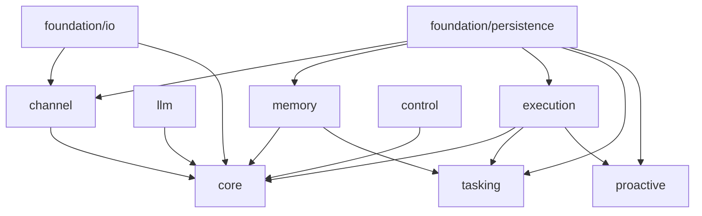

# Pal Runtime Stack

> 目标：定义目标模块骨架、拥有边界和对外接口。

## 总览



## foundation/io

### Owns

- async transports
- subprocess / stdio / pipe
- timers
- streaming primitives
- socket and network watchers
- raw message envelopes
- IPC framing and codecs

### Does Not Own

- business routing
- capability semantics
- memory logic
- plugin lifecycle

### Exposes

- `EventEnvelope`
- transport adapters
- async mailbox primitives
- stream / process runners
- IPC envelope / peer primitives

## foundation/persistence

### Owns

- database connection lifecycle
- transaction boundary
- migration runner
- base repository utilities

### Does Not Own

- memory semantics
- channel routing policy
- execution governance
- tasking rules

### Exposes

- `Database`
- transaction scope
- migration runner
- repository base abstractions

## channel

### Owns

- inbound receive
- outbound send
- segmented send
- ingress acknowledgement UX
- typing / status feedback
- endpoint lookup from DB
- endpoint identity
- normalize
- reply routing
- envelope creation
- `Pal`-owned user-facing channel runtime
- provider registry and runtime-root provider discovery
- provider-owned endpoint lifecycle forwarding
- channel-owned interaction realization

### Does Not Own

- agent reasoning
- memory persistence
- capability execution
- approval policy
- platform-specific interaction behavior in core
- provider-specific attach/detach implementation details

### Exposes

- `EndpointConfig`
- `ResponseHandle`
- `ChannelProvider`
- `ChannelEndpointProviderManager`
- `FactoryChannelProvider`
- `ChannelEnvelope`
- runtime provider manifest contract

### Identity Rule

channel identity 固定为：

- `channel_kind + endpoint_id`

它不等于 conversation identity，也不等于 memory identity。

`channel_kind` 是 endpoint row 的持久化类型 discriminator，用于反序列化和 endpoint/provider 匹配。它不应该成为 core 推断平台行为的依据。

运行期 channel 行为由 provider 下沉到具体 endpoint 类型中：

- manager 通过 endpoint id 或 endpoint type 找到 provider
- provider 决定如何 attach/detach/restart
- provider 决定 introspection 字段
- provider 决定 interaction 的平台 realization

### Provider Rule

channel provider 可以来自 builtin，也可以来自 runtime root：

```text
<runtime_root>/channel/providers/<provider_id>/
  provider.toml
  runtime.py
```

`ChannelEndpointProviderManager` 负责物理 provider 发现、代码 RAII、endpoint hub
拓扑和 capability 入口。内部 hub registry 早来晚走；LLM execution registry
迟到早退。

Provider 自己负责：

- endpoint factory or endpoint construction
- endpoint lifecycle
- auth/backlog/health introspection
- slash command or menu publication when the platform supports it
- interaction rendering
- callback/result normalization

这保持了统一管理入口，同时避免把 Telegram inline keyboard、socket JSON event、CLI 文本菜单等 realization 写进 core。

### Legacy Alignment

旧版 `DeliveryRoute` 语义在新架构中拆成：

- `EndpointConfig`
- `ResponseHandle`

保留“哪里来的，哪里回去”的回复路由原则，但不再让 route 成为 memory ownership 的核心抽象。

旧版 `ChannelAdapter` / `ChannelNormalizer` 语言应理解为 endpoint/provider 内部实现细节。公开架构边界以 `ChannelProvider`、`ChannelEnvelope`、`ResponseHandle`、`EndpointConfig` 为准。

### IM UX Rule

IM channel 默认采用三阶段反馈：

1. ingress accepted
2. typing / processing visible
3. final reply delivered

对于 Telegram，推荐默认实现为：

- 消息入队后立即给用户消息打 `eyes` 标记
- 随后切换 typing
- 最终再发送正式回复

这只是 Telegram provider 的 realization。其他 channel 可以选择 JSON status event、textual ack、web UI state 或无噪音状态更新，只要 typed interaction/result contract 不变。

## llm

### Owns

- canonical request / outcome / stream event
- provider transport normalization
- prompt assembly inputs
- request and response canonicalization
- structured parse boundary
- model selection signals
- endpoint candidate resolution
- fallback candidate building
- streaming assembly and forwarding
- native tool-calling wire adaptation

### Does Not Own

- durable state
- side effects
- tasking state
- scheduler state

### Exposes

- canonical request and response models
- `LLMStreamEvent`
- `LLMEndpointConfig`
- provider registry
- structured parse helpers
- canonical tool call / result models

### Canonical Shape Rule

`llm` 内部必须维持 vendor-agnostic canonical shape。

至少包括：

- canonical request
- canonical outcome
- canonical tool definition
- canonical tool call
- canonical tool result

外部 provider 只负责把这些 canonical objects 变形成各自 wire shape。

### Transport Strategy

`llm` 默认保留 canonical/provider 分层，transport 层按 endpoint shape 路由到具体 native SDK。

也就是说：

- `Pal` 自己定义 canonical protocol
- OpenAI-compatible chat/completions 走 OpenAI SDK
- Anthropic Messages 走 Anthropic SDK
- provider native tool calling 仍然不能绕过本地 `Execution`

### Registry Rule

模型能力与路由信息应收敛在本地数据库中，而不是完全依赖 provider 在线发现。

推荐继续使用并扩展 `llm_endpoints` 作为：

- 本地模型能力表
- endpoint candidate registry
- fallback priority source

`priority` 是 routing priority，不是质量权重。runtime 按升序构造 fallback candidate：数字越小越先尝试。生产配置应使用非负小整数，不要用负数制造特殊优先级。

## memory

### Owns

- `L1`
- `L2`
- `L3` provider contract
- compact
- recall
- retire
- memory pack projection

### Does Not Own

- channel state
- execution policy
- bunshins lifecycle
- proactive lifecycle

### Exposes

- `MemoryService`
- `L3Provider`
- `MemoryPack`
- memory lifecycle contracts

## execution

### Owns

- capability registry
- capability routing table
- tool registry
- fallback-capable provider registries
- introspection index
- validator pipeline
- side-effect dispatch
- plugin runtime
- skill runtime

### Does Not Own

- conversation state
- durable memory truth
- control decisions
- bunshins planning policy

### Exposes

- `CapabilityDescriptor`
- `CapabilityCall`
- `CapabilityResult`
- `ToolBinding`
- `PluginManifest`
- `ExecutionRuntime`

### Built-in Tooling Rule

`Pal` 可以拥有少量内建工具，但应保持极简。

推荐原则：

- 常见 UTF-8 文件读写改优先通过结构化文件能力，例如 `file_read`、`file_edit`、`file_write`、`file_state`
- 命令、测试、构建、脚本执行通过 `shell`
- `web_search` 保留为独立能力与 provider family
- `web_fetch` 是 Plugin Hub 管理的 stateful browser 插件；原始 HTTP 足够时由主 Pal 显式使用 `curl`

也就是说：

- 不必为每个本地动作都发明单独 built-in tool
- `shell` 是通用 escape hatch，但不是文件读写查改的默认路径
- 但需要结构化 provider 选择或外部信息能力的场景，应保留独立 capability family

## control

### Owns

- explicit control parsing
- approval workflow
- pause and resume semantics
- deterministic control actions
- system control event normalization

### Does Not Own

- general chat reasoning
- tool execution
- durable state storage
- plugin implementation

### Exposes

- `ControlPlane`
- `ControlAction`
- `ControlEvent`

## core

### Owns

- main event loop
- minimal control state
- coordination across planes
- turn orchestration
- follow-up event emission

### Does Not Own

- business data truth
- tool registry details
- durable memory
- work order details
- proactive run details

### Exposes

- `PalCore`
- event dispatcher
- turn runner

## tasking

### Owns

- plan review
- task context pack
- work order lifecycle
- bunshins orchestration
- checkpoint continuity
- bunshins lifecycle observation
- bunshins termination and replacement

### Does Not Own

- core governance
- channel transport
- LLM provider lifecycle
- global execution policy

### Exposes

- `TaskingPlugin`
- work draft and plan contracts
- bunshins checkpoint contracts
- bunshins observation and termination capabilities

## proactive

### Owns

- scheduled triggers
- recurring proactive task state
- proactive run lifecycle
- due event materialization
- output channel binding
- proactive action contract

### Does Not Own

- core loop
- memory ranking
- plugin routing
- bunshins execution policy

### Exposes

- `ProactiveDefinition`
- proactive trigger contracts
- proactive run contracts

### Proactive Shape Rule

proactive task 的内部定义至少应表达：

- 你要做什么
- 你如何做
- 是否要带某个 skill/manual 来做

并且：

- `out_channel_id` 可选；设置后必须能被 channel runtime 解析
- `out_reply_target` 保存 endpoint-specific reply metadata
- output channel 无法解析时，本次 proactive run 不发 channel 输出，但 run history 仍然保留

## 关键接口清单

这些接口名称在后续实现中视为保留名：

- `EventEnvelope`
- `ResponseHandle`
- `EndpointConfig`
- `ChannelProvider`
- `ChannelEndpointProviderManager`
- `PalCore`
- `ControlPlane`
- `CapabilityDescriptor`
- `CapabilityCall`
- `CapabilityResult`
- `ToolBinding`
- `PluginManifest`
- `MemoryService`
- `L3Provider`

## Invariants

- `Channel` 只做 I/O、normalize、reply route、UX feedback 和 interaction realization。
- `ChannelProvider` 拥有 endpoint lifecycle 与 provider-specific introspection。
- `ChannelEndpointProviderManager` 只负责注册、扫描、路由和统一 capability 入口。
- `Pal` 自己持有用户前台 channel。
- 多个 channel 连接的是同一个 Pal subject，不产生独立人格或独立 memory identity。
- `LLM` 不直接产生副作用。
- `LLM` 内部保持 canonical shape，对外再适配 provider shape。
- `Memory` 拥有 `L1/L2/L3` 语义，但不越过 `Execution` 做 effect。
- `Execution` 拥有副作用治理权。
- `Control` 拥有显式控制语义。
- `Core` 只做协调，不拥有领域真相源。

## Non-Goals

- 不定义字段级数据库 schema
- 不定义具体 Python 包内文件名
- 不规定第一版 plugin marketplace 机制
- 不把 `Task`、`Proactive` 提升为 Core owned subsystem
