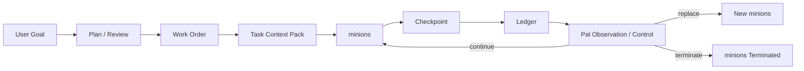

# Pal Tasking Contract

> 目标：定义 `tasking`、`minions`、checkpoint、ledger、workspace 治理，以及 `Pal` 如何观察和终止 minions。

## 目标

`tasking` 是 `Pal` 处理专业性任务和长链执行的正式子系统。

这一版的重点不是重发明 task subsystem 语义，而是把旧版本里已经比较明确的 task / minions / work_order / approval / checkpoint / ledger 语义，正式从 `Pal runtime` 身上剥离出来，收成 first-party plugin family。

它的意义不是“再开一个执行器”，而是把不适合 `Pal` 直接完成的工作放进：

- 干净的 task context
- 可替换的 minions execution world
- 可检查、可恢复、可记账的执行链

## 旧语义对齐原则

`tasking` 在新架构中默认继承旧版本的核心语义。

需要保留的旧语义包括：

- `Pal` 是主体，minions 不是主体
- `supervisor -> pal -> minions` 的进程关系
- minions 不直接接触用户，只与 `Pal` 通信
- `work_order` 是正式对象，不是临时执行片段
- `approval` 是正式对象，不是瞬时按钮
- continuity 绑定 `checkpoint / ledger`，不绑定单个 minions 进程
- workspace / branch / artifact 是 task execution 的正式现场

因此，新版本在这一块主要改变的是：

- ownership
- registration
- observability
- governance integration

而不是 task subsystem 的业务含义本身。

## Process Model Alignment

旧版本中已经稳定成立的 process model 在新架构中直接保留：

- `supervisor` 是 lifecycle manager
- `Pal` 是 front-control-runtime
- `minions` 是 execution child

运行关系固定为：

- `supervisor -> pal -> minions`

其中：

- `supervisor` 负责拉起、监控、重启 `Pal`
- `Pal` 负责和用户交互、治理任务、观察 minions
- `minions` 负责执行 task / work order

## IPC Plane Alignment

旧版本中已经形成的 IPC 分层在新架构中继续保留：

1. `supervisor <-> pal`
2. `pal <-> minions`

这两条链职责不同，不应混成一条“万能消息总线”。

### `supervisor <-> pal`

这是 control plane / lifecycle plane。

它只承载：

- transport ready
- runtime log
- lifecycle signal
- shutdown / health-like event

它不承载：

- 正常用户消息
- 正常用户回复
- 普通 turn payload

### `pal <-> minions`

这是 execution plane。

它承载：

- planning request
- work order open
- ack / progress update
- checkpoint emission
- done / failed
- process exit

其传输实现未来可以替换，但 plane boundary 本身视为保留语义。

## 核心原则

- `Pal` 负责治理任务，不直接承担 minions 该做的专业执行
- minions 是 replaceable execution actor，不是主体
- continuity 绑定 checkpoint / ledger / workspace state，不绑定单个进程
- `tasking` 的 effect surfaces 必须通过 capability 暴露
- `Pal` 必须能观察 minions 状态，也必须能终止 minions

## Owns

- task lifecycle
- work order lifecycle
- planning handoff
- minions orchestration
- checkpoint continuity
- ledger
- workspace / branch governance
- minions state observation
- minions termination and replacement

## Does Not Own

- global core governance
- tool execution runtime
- memory ranking
- channel transport
- approval constitution

## 运行模型

## Tasking 的核心对象

## Work Order

`work order` 是一次正式执行委托。

它必须能表达：

- goal
- scope
- plan steps
- acceptance criteria
- verify strategy
- active minions
- current status

`work order` 的旧语义在新架构中直接继承。

## Task Context Pack

`TaskContextPack` 是 `Pal` 发给 minions 的执行上下文包。

它至少包含：

- plan pack
- task-scoped memory
- relevant system-wise memory
- current checkpoint
- workspace info
- branch info
- allowed skills
- allowed tools
- constraints

## Checkpoint

`checkpoint` 是 continuity 的一等对象。

它不是可有可无的日志，而是 minions continuity 的恢复点。

checkpoint 至少表达：

- progress summary
- completed steps
- next resume point
- repo/workspace state summary
- key artifacts
- verification snapshot

## Ledger

`ledger` 是 tasking 的正式记账层。

它用于记录：

- minions accepted
- minions progress updates
- checkpoint emission
- minions replacement
- minions termination
- final closeout

ledger 的作用是：

- 形成 continuity truth
- 支撑恢复和复盘
- 支撑 developer escalation

## Approval

`approval` 是 tasking 相关的正式对象。

它不是瞬时 UI 动作，而是：

- 有 proposal snapshot
- 有 target
- 有 decision lifecycle
- 有 pending / approved / rejected / consumed 等状态

approval 的治理入口属于 `Control`，但其任务语义仍然属于 tasking domain。

## Workspace / Branch Model

`tasking` 默认使用基于 git 的近似沙箱环境。

这里的“近似沙箱”含义是：

- 不是操作系统级隔离
- 而是通过 workspace / branch / artifact 边界约束 minions 的改动范围

tasking 必须治理：

- workspace location
- active branch
- artifact references
- repo conflict checks

## minions 是 Replaceable Actor

minions 不是主体，`Pal` 才是主体。

minions 必须满足：

- 可启动
- 可替换
- 可终止
- 可由 checkpoint 接棒恢复

continuity 不绑定单个 minions 进程。

## Failure And Recovery Semantics

### `Pal` 崩溃

- `supervisor` 负责拉起新的 `Pal`
- 新 `Pal` 从 durable state 和当前现场重新观察恢复
- 不允许盲续旧执行栈

### minions 崩溃

- `Pal` 通过 IPC 或 process exit 感知 minions 退出
- `Pal` 基于 checkpoint / ledger / work order state 决定报告、替换或终止
- continuity 仍然不绑定单个 minions 进程

## Tasking Capability Surface

`tasking` 必须至少注册这些 capability：

- `tasking.plan.*`
- `tasking.work_order.*`
- `tasking.minions.observe`
- `tasking.minions.checkpoint.read`
- `tasking.minions.terminate`
- `tasking.minions.replace`
- `tasking.workspace.inspect`

其中：

- `tasking.minions.observe` 允许 `Pal` 读取 minions 当前状态
- `tasking.minions.terminate` 允许 `Pal` 杀死 minions
- `tasking.minions.replace` 允许 `Pal` 基于 checkpoint 拉起新 minions

## minions Observation Contract

`Pal` 必须能观察到 minions 的最小状态：

- minions id
- bound work order id
- current status
- last progress update
- last checkpoint
- last heartbeat
- current workspace
- current branch
- pending approval state

## minions Termination Contract

`Pal` 必须拥有终止 minions 的能力。

允许终止的典型原因：

- 用户明确取消
- runaway / hung minions
- approval 被拒绝
- health check fail
- maintenance replacement

终止后必须写 ledger，并保留：

- termination reason
- latest checkpoint
- restart eligibility

## 与 Execution 的关系

`tasking` 是 first-party plugin family。

这意味着：

- 它通过 capability surfaces 接入 `Execution`
- 它的 effect 最终仍然经 `Tool`
- 它不是 `Core` 的私有实现细节
- 它在执行语义上继承旧 task subsystem，只是在新架构里改为插件化挂载

## 与 Memory 的关系

`Pal` 不应直接把自己的聊天上下文原样交给 minions。

正确路径是：

- 从 memory subsystem 取 task-scoped memory
- 取 relevant system memory
- 组装成 `TaskContextPack`
- 交给 minions

这样 minions 拿到的是干净、收敛的任务上下文。

## 与 Control 的关系

minions approval 请求必须进入 `Control`。

minions 终止和替换虽然属于 tasking capability，但仍可能受 control governance 约束，尤其在：

- 用户显式取消
- 高风险 maintenance
- destructive replacement

## Invariants

- `Pal` 负责治理任务，minions 负责执行任务。
- minions 是 replaceable actor，不是主体。
- task subsystem 的旧语义默认保留。
- continuity 绑定 checkpoint / ledger，不绑定单个进程。
- `tasking` 默认使用 git-based approximate sandbox。
- `Pal` 必须能观察 minions 状态。
- `Pal` 必须能终止 minions。
- 专业性强或 maintenance 级任务必须进入 `tasking / minions`。

## Non-Goals

- 不在本文件定义具体 git 命令序列
- 不在本文件定义 checkpoint 的数据库 schema
- 不在本文件定义 minions UI
- 不允许 `Pal` 直接替代 minions 执行长链专业任务
